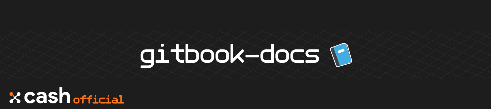

# Welcome 👋

## About

The **X-Cash Foundation is an open-source, no-ICO blockchain project** launched in 2018 developing a privacy centered cryptocurrency inheriting from Monero and bringing new innovation in the privacy coin space.

X-Cash main features are: 

* **FlexPrivacy - Private and public transactions on the same blockchain** Private by default, X-Cash's FlexPrivacy lets the user decide if he/she wants the transaction to be made public.
* **Delegated-Proof-of-Private-Stake - X-Cash custom consensus designed for privacy coins** X-Cash consensus model gets rid of the decentralized yet unsustainable PoW consensus to propose its own variation of a DPoS with DBFT consensus. 
* **Sidechains - The next step in blockchain hosting** X-Cash will make it easy to create and host your own blockchain, while being able to profit from X-Cash's unique features. 

The document was written and aggregated by the X-Cash Foundation, the X-Cash development team and contributors. If you would like to learn more about contributing please the visit our [Github](https://github.com/X-CASH-official/) organization.

## Get Started

Looking to use X-Cash but don't know where to start? Check our list of quick guides:

| What are you looking for? | Description |
| :--- | :--- |
| **I want to connect to the network and create a node.** | X-Cash nodes interact with each other through a daemon. Check the daemon documentation - [xcashd](applications/xcashd.md) to connect to the network. |
| **I want to stake my XCASH.** | You can stake your XCASH towards a delegate and earn rewards depending on your vote. Check our our stake and voting section. |
| **I want to become a delegate and start forging X-Cash.** | You want to be part of  the limited delegates that have the power to forge the next block? Have a look a our set up a delegate node guide. |
| **I want to create/open a wallet.** | Go to the CLI wallet documentation \([xcash-wallet-cli](applications/xcash-wallet-cli.md)\) to learn everything about the X-CASH wallet and the different commands. |
| **How can I interact with the wallet or daemon?** | You can interact with X-Cash with Remote Procedure Calls.  Have a look at [xcash-daemon-rpc](applications/rpc-calls/json-rpc-methods/) and [xcash-wallet-rpc](applications/rpc-calls/xcash-wallet-rpc/) to learn more. |
| **I want to import a blockchain file.** | You can bootstrap your synchronization if you already have a RAW file of the blockchain. Check out the full documentation of [xcash-blockchain-import](applications/xcash-blockchain-import.md) |
| **I am looking for the API.** | Check out our API section. |

### Useful Links

#### General links

* [**X-Cash website** ](https://xcash.foundation)- The official website of the X-Cash project.
* [**X-Cash official blog**](https://medium.com/x-cash) - Read about the latest development of X-Cash
* [**X-Cash explorer** ](https://explorer.x-cash.org/Explorer)- See your ongoing transactions and explorer the X-CASH blockchain.
* [**GitHub**](https://github.com/X-CASH-official) - The X-Cash source code and related repositories. 
* [**X-Network**](https://x-network.io) - Check everything about X-Cash related development from the founding team.
* [**Help Center**](https://xcashteam.atlassian.net/servicedesk) - If you encounter a bug, or want to communicate on improvements.

#### Community

* [**Discord** ](https://discord.gg/4CAahnd)- Engage with the community, ask questions and talk with the team.
* [**Twitter**](https://twitter.com/home) - Follow us for weekly updates, contests and community polls.
* [**Reddit**](https://www.reddit.com/r/xcash) - Join the Reddit community
* [**Telegram**](https://t.me/xcashglobal) - Get the latest news and announcement of anything X-CASH related

#### Technical Litterature

* [**FlexPrivacy**](https://x-network.io/whitepaper/XCASH_Yellowpaper_Hybrid-tx.pdf) - Public and Private transactions on the X-Cash blockchain.
* [**DPoPS**](https://x-network.io/whitepaper/XCASH_Yellowpaper_DPoPS.pdf) - Delegated Proof-of-Private-Stake, a DPoS implementation under X-Cash.

## Sources

As a fork of Monero, most of the basic functions of X-Cash are already documented.  These functions are transcribed from the official Monero documentation:

* [**https://monerodocs.org/**](https://monerodocs.org/interacting/monerod-reference/)
* [**https://web.getmonero.org/resources/developer-guides/**](https://web.getmonero.org/resources/developer-guides/daemon-rpc.html)
* [**https://moneroexamples.github.io/**](https://moneroexamples.github.io/python-json-rpc/)

