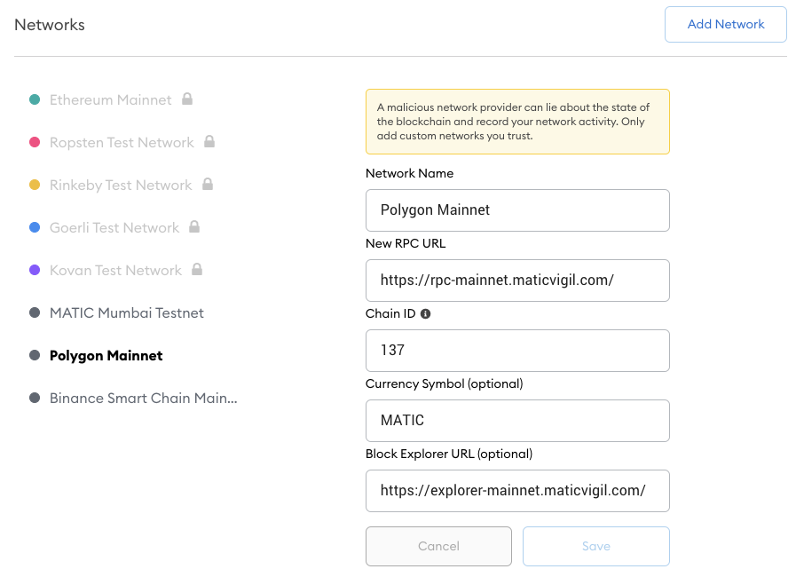

# WXCASH

## **Introduction**

This tutorial will act as a guide for step-by-step process to understand and use WXCASH, a wrapped representation of an XCASH coin on the Polygon and Ethereum network.

We are mentioning here **WXCASH** to talk about any wrapped token represensation of XCASH, being on Polygon and Ethereum network. In this guide, we will make the differentiation with the following pattern: **`Coin Name (Network)`**. You will see:

* **XCASH \(X-Cash\):** This is the XCASH coins interacting on the X-Cash network. This is the basic network, governed through the DPOPS consensus and validated by 50 delegates.
* **WXCASH \(Polygon\):** This is an ERC20 token representing a wrapped version of XCASH on the Polygon \(Matic\) Network. This is the version of the wrapped coin you will have after performing a swap on the [X-Bank](https://x-bank.io/), the X-Cash Foundation managed wallet.  _Contract address:_  [_0x03678f2c2c762dc63c2bb738c3a837d366eda560_](https://polygonscan.com/token/0x03678f2c2c762dc63c2bb738c3a837d366eda560)\_\_
* **WXCASH \(Ethereum\):** ERC20 token on the root chain \(Ethereum\). As the WXCASH \(Polygon\) is running on a child chain on Polygon, you need to use the PoS Polygon Bridge to withdraw them on the Ethereum network. ****_Contract address:_ [_0x235328f864f38a91f0d2282159ea7c7b7c9f7c62_](https://etherscan.io/token/0x235328f864f38a91f0d2282159ea7c7b7c9f7c62)\_\_


The Polygon network has [rebranded](https://cointelegraph.com/news/matic-rebrands-to-polygon-in-pursuit-of-polkadot-on-ethereum-strategy) a few months ago. It was previously called Matic Network. When interacting with the network, you might see Polygon and Matic names cohabiting from time to time. They are the same, and you shouldn't worry


We will explain how to interact with the different networks, with the necessary

1. Swap XCASH from the X-Cash network to Polygon \(X-Cash → Polygon\)
2. Withdraw assets from Polygon on to root chain with the Matic Bridge \(Polygon → Ethereum\)

And the other way around

1. Go from the root Ethereum chain to Polygon with the  \(Ethereum → Polygon\)
2. Withdraw assets from Polygon on to root chain \(Polygon → X-Cash\)

## XCASH \(X-Cash\) ↔ WXCASH \(Polygon\)

To swap your XCASH \(X-Cash\) to WXCASH \(Polygon\), the **only** way is through the [X-Bank](https://x-bank.io). 


As of today, there is no other way to swap XCASH \(X-Cash\) to WXCASH \(Polygon\), only  through the X-Bank Swap feature. Don't try to get WXCASH any other way, it will result in a loss of your funds.


Go to your X-Bank account to start, select the **Swap** page. 

Select the base amount of currency you would like to swap, the amount, and select "**Swap**". You will be prompted to validate the 1:1 swap. Validate to swap your XCASH to WXCASH, and vice versa. 


The swap within the X-Bank is **free**, and will always be!


Once you have WXCASH in your X-Bank account, you can now transfer them and send them to a ERC-20 address. 

You have several ways to get an ERC-20 address, and we recommend using [Metamask](https://metamask.zendesk.com/hc/en-us/articles/360015489531-Getting-Started-With-MetaMask) or any other ERC-20 compatible wallet that supports the Polygon \(Matic\) Network. 

#### Add the Polygon \(Matic\) Network to Metamask

You will need to add the Polygon \(Matic\) network to your Metamask application to be able to see your WXCASH \(Polygon\) tokens in your wallet. To add the Polygon \(Matic\) network, you just need to select "Custom RPC" in the Networks panel

And add the following information:

**Network Name**  
Polygon Mainnet

**New RPC URL**  
https://rpc-mainnet.maticvigil.com/

**Chain ID**  
137

**Currency Symbol \(optional\)**  
MATIC

**Block Explorer URL \(optional\)**  
https://explorer-mainnet.maticvigil.com/

Then save. You will be able to select this network in Metamask now.

#### Add the WXCASH \(Polygon\) token to Metamask

Once you have added the Polygon Network in your Metamask network selection, you can add the WXCASH \(Polygon\) token to your wallet. Click on **Add Token** at the bottom of the screen.

And in the contract address field, paste the following: **`0x03678f2c2c762dc63c2bb738c3a837d366eda560`**


This contract address is the official and only contract address for WXCASH \(Polygon\). Always make sure that you are sending WXCASH \(Polygon\) with this contract address.


You can now see WXCASH \(Polygon\) in your Metamask wallet.

#### **Withdraw WXCASH \(Polygon\) on the X-Bank**

You can now withdraw WXCASH \(Polygon\) from the X-bank to your ERC-20 wallet. You just need to select the **Withdraw** page in the X-bank, select WXCASH currency to withdraw, input an amount and your ERC-20 address \(provided in your Metamask wallet\), and select withdraw. 


Because Polygon's transfer fees are so low, we have decided for the time being to keep the withdrawals free for the X-Bank users.


After a few necessary confirmations, the withdraw will be taken into account and you will be able to see your WXCASH \(Polygon\) tokens in your Metamask wallet.

#### **Deposit WXCASH \(Polygon\) on the X-Bank**

To deposit WXCASH \(Polygon\) to the X-Bank, you can use your Metamask transfer function.

First, go to the **Deposit** page on the X-Bank, select the WXCASH currency and check Deposit instructions. It will give your deposit ERC-20 address. This address can only be used to deposit **WXCASH \(Polygon\)** in. 


Depositing anything else than WXCASH \(Polygon\) on your X-Bank deposit address **will result in a permanent loss of your funds**.


On your Metamask transfer page, input your X-Bank ERC20 deposit address, the amount you wish to send, and click on Send.


You will need to pay the gas fees to perform any transaction from your Metamask wallet. Because you are on the Polygon network, you will need to use MATIC native token to pay for the gas.   
You can either buy some on exchange platforms where MATIC is listed, or you can try the [MATIC faucet](https://matic.supply/) to get enough to perform a few transactions. 

Luckily, the transaction fees are really small.


The amount will be credited to your X-Bank account shortly after. 

## WXCASH \(Polygon\) ↔ WXCASH \(Ethereum\)

Now that you have WXCASH \(Polygon\) in your Metamask account, you can use the [Polygon Bridge](https://wallet.matic.network/) to withdraw them to the Ethereum Chain. 

You can connect your Metamask wallet to the Polygon Web Wallet interface. Please follow [this guide](https://docs.matic.network/docs/develop/wallets/matic-web-wallet/web-wallet-v2-guide) to help you see your WXCASH \(Polygon\) in the Polygon Web Wallet.

Once you have connected your Metamask wallet to the Polygon Web Wallet, you will be able to see your WXCASH \(Polygon\). You can now use the **withdraw** \(to Ethereum\) ****function:

 

On the next page, select the number of WXCASH \(Polygon\) that you want to move to the Ethereum chain. They will become WXCASH \(Ethereum\). 

You can then initiate the transfer, where you'll be prompted to validate.

The withdraw to the Ethereum chain will cost you a transaction on the Polygon Network, and a transaction on the Ethereum network. 

**It means that to complete a withdraw to the Ethereum network, you will need some MATIC on the Polygon Network, as well as some ETH on the Ethereum Network.** 

## 

