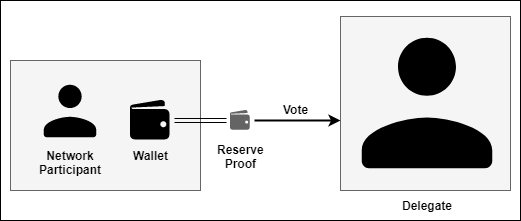
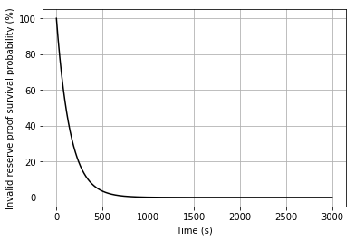
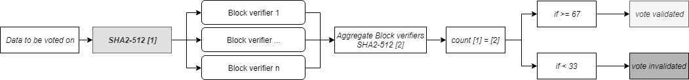

# Technical Design

## DPoPS: Delegated Proof-of-Private-Stake, a DPoS implementation under X-Cash, a Monero based hybrid-privacy coin

_Guilhem Chaumont, Paul Bugnot, Zach Hildreth, Balthazar Giraux_

_**Version 1.0**_

## **Abstract**

This document gives an extensive summary of the components of DPoPS, a Delegated Proof-of-Private-Stake implementation under X-Cash, a Monero based hybrid-privacy coin. The change of consensus algorithm from Proof-of-Work to Delegated Proof-of-Stake is a significant milestone for the X-Cash blockchain, and will also bring innovation to CryptoNote, Monero and the overall blockchain ecosystem.

Delegated Proof-of-Stake \(DPoS\) is an efficient, decentralized, democratic, and flexible blockchain consensus framework which has been actively researched in the last years. However, the private nature of a coin can make DPoS implementation challenging as balances are obfuscated. As a representative system, DPoS needs the right balance of transparency to remain efficient, and most privacy coins cannot cope with missing part of their opacity. 

To address this challenge, we would like to suggest DPoPS, an improved Delegated Proof-of-Stake algorithm for privacy coins. DPoPS inherits all the advantages of the original DPoS consensus while offering the opportunity to be used in a privacy coin. 

From a technical implementation perspective, it has been chosen to use a combination of Delegated Proof-of-Stake and delegated Byzantine Fault Tolerance \(DBFT\) with the use of Verifiable Random Functions \(VRF\) for the block producer election. As X-Cash is a privacy-based coin where balances are hidden, Monero’s reserve Proofs are extensively used through the election process.

## Introduction

In a centralized system, all parties of an ecosystem refer to the decision making of a known and trusted third-party; the general consensus is not needed, as the centralized entity administers the decisions and validations. In a decentralized system \(blockchain, DLTs, etc.\), reaching consensus is challenging as every party must agree to the majority on a similar decision, instantly and without fault. Algorithmically, several solutions have been developed to solve this issue, namely, but not limited to, Proof-of-Work \(PoW\), Proof-of-Stake \(PoS\) or Delegated Proof-of-Stake \(DPoS\) \[1\] \[2\].

Until recently, most privacy coins were backed by Proof-of-work algorithms mainly for historical reasons and because the private nature of these blockchains made it hard to reveal one’s stake in the blockchain without voiding the anonymity principle of the blockchain entirely.

In the last few years, we have seen Proof-of-Stake privacy coins emerge using mixing and conjoin methods to allow private transactions. Having a private balance and stake is another problem in itself. Some blockchain successfully achieved partial or complete anonymity of staking through a combination of reserve proof and transaction mixing. If privacy can be promoted and even guaranteed using a Proof-of-Stake algorithm, it is imaginable that a blockchain could host a privacy coin while using a Delegated-Proof-of-Stake algorithm.

What makes DPoS appealing is that it allows anyone with a minimal amount of coins to take part directly or indirectly in the consensus process while having the same benefits as a PoS algorithm - being more energy-efficient and flexible, having a quicker transaction broadcasts, and being more attack-proof \[3\]. In a way, DPoS allows more people to take part in the governance of a blockchain than PoS, and one could argue that it is closer to the general principle of decentralization because it is more open to the public.

However, applying DPoS to a privacy coin is quite challenging due to the private nature of the blockchain. The same challenges as for PoS have to be faced \(stake and balance privacy\) and voting privacy also has to be guaranteed.

Achieving a DPoS consensus in a privacy coin would prove that blockchain could be an alternative to traditional governance models - including the ones used outside of the blockchain ecosystems. In this paper, we are exploring one of the possible paths enabling a DPoS consensus in a CryptoNote \(CN\) coin. This path could pave the way for Monero and other CN coins to a new governance model.

In order to explain the challenges in the implementation of DPoS in privacy coins, more especially in CN coins, we will expose the state of the art of DPoS. Then, we will discuss the different points which need to be addressed in order to make this blockchain consensus applicable to privacy coins. Lastly, we will explain the way we implemented DPoPS in the X-CASH protocol.

## State of the art

There are two primary reasons behind the creation of the DPoS consensus \(and PoS to some extent\). Dan Larimer most specifically references the fact that bitcoin’s Proof-of-Work is too wasteful \[4\]. Much energy is poured into bitcoin mining, and there are probably other alternatives to achieve the same goal. He was also looking at improving the speed efficiency of the algorithm. The redundancy of Proof-of-Work was, in his mind, one of the shortcomings of the bitcoin.

DPoS is designed to be as robust as Bitcoin’s Proof-of-Work algorithm, competitively fast \(if possible as fast as a centralized exchange database\) while still being open and decentralized.

Larimer successfully implemented DPoS in BitShares, Steem, and EOS. Now, more and more projects are successfully using DPoS as a governance model for their blockchain architecture \(Ark, Cardano, Tezos, Lisk, etc.\).

In order to explain what a DPoS consensus is about, we will discuss the different points/aspects making DPoS unique. First, we will address the block producing process before studying the role the delegates play in the consensus. Then, we will discuss the standard DPoS election process and its consequences to expose the security advantages this algorithm offers finally.

### Block production in DPoS

The reason Proof-of-Work, and to some extent PoS, is deemed inefficient - both regarding energy consumption and blockchain speed - is the fact the whole network takes part in blocks validation \(e.g. transactions validation\). This principle - necessary to guarantee a neutral and censorship-resistant creation of blocks - is given to a select few in DPoS called Block producers.


### Block production and the delegates’ role

These block producers are selected from the delegates at specific times during a block production round. The delegates are elected through a process where token holders can cast their votes proportionally to the voter’s stake in the network. This election process allows token holders to commission a delegate to represent them while still holding their assets in cold storage. Particl has called this “cold staking” \[5\]. At the end of each election, the top candidates gathering the most votes are elected.

The quantity of delegate spots is usually an odd number and can vary significantly depending on the blockchain. A higher number of delegate nodes is commonly associated with a better decentralization while being done at the cost of lower performances.

It is important to note that the number of delegates is usually much lower than the number of nodes in both PoW \(miners\) and PoS \(stakers\) blockchains. This is why DPoS is usually deemed more centralized than competitors’ consensus.

In a DPoS blockchain, every new block a delegate is selected to become the block producer in a round-robin manner and is given a time slot during which it is supposed to produce a block. In case of default of a block producer, the next block producer is selected and is in charge of forging the block. This means that the round time is linked to the blockchain’s specific block time and never changes.

In order to produce a block, the current block producer refers to the consensus node\(s\) to establish the current state of the network and validate both the blocks and their link in the chain. This goes to show how essential delegates and consensus nodes are in DPoS. In bitcoin’s proof of work, while only miners can create blocks, every node in the network \(full and light nodes\) verifies the integrity of both transactions and blocks.

### Election process and block reward

The election process is different in every DPoS blockchain - the beginning, the duration and the ending of the process can vary in terms of conditions and times. This being said, the election processes usually follows the same path. Token holders vote for a delegate in order to increase its chances of becoming a block producer by gathering more votes than its competitors. The vote in itself is given to a delegate for a specific period and tacitly reconducted if the voter did not change its vote. This implies that the voter can change its vote at any time during a round in anticipation of the next election round.

Because delegates are elected, the block reward for successfully producing a block is usually shared and spread to the voters in order to reward them of their trust. This creates an incentive for the votes to delegate their stakes and for their representatives to be the avatar they were elected to be. A social contract of sorts if passed between delegates and voters.

At the end of each round, a new election takes place, allowing voters to reassess their position. This system promotes delegates’ responsibility towards their electorate and having a shorter round is not that big of a deal in a blockchain system. In a political system, on the other hand, even though having a short mandate is deemed to be promoting politicians’ responsibility, it is also considered to lead to immobilism.

At the end of each round, the network checks the delegates’ status from the last election list before starting the next block production round.

### DPoS and security

As for any blockchain, the DPoS algorithm needs to guarantee the security of the network. It is possible to divide attacks into two groups: attacks from network actors and attacks from outside sources, purely perpetrated to damage the network.

#### Attacks from network actors

First of all, an actor could benefit from cheating the rest of the network. It is important to remember that voters play an important role in a DPoS blockchain - they elect the delegates who can become block producers. By doing this, they also take part in the network’s security and “checks and balances” system. Because the token holders elect delegates every round, the system promotes a virtuous circle where delegates have more incentive to represent their electorate the best way possible since their mandate is at stake.

Just as in PoS, the staking system helps prevent the number of bad actors in the network. As opposed to PoW, to become a block producer one needs to prove its interest in the success of the network through a staking mechanism. The fundamental rationale behind this process is to make sure that a significant stake is collateralized by the actors in charge of the consensus. Therefore, they are mechanically incentivized to behave in a manner that will not negatively impact the coin behind the blockchain. For instance, in case of a double spend or a DDOS attack performed by the delegates, the market capitalization of the coin would be significantly impacted, making the loss from the collateral devaluation more harmful than the potential profits from the attack. More generally, anybody who is willing to benefit from the network - whether through block minting or voting - has an interest in protecting the network’s integrity through this collateralization process. In consequence, the incentive of being a bad actor in the network drops significantly.

#### Attacks from outside sources

As discussed, the hypothesis could arise that outside actors could benefit from damaging the blockchain. In a PoW blockchain, an attack could damage the network through what is known as a “51% attack”. In this specific case, one needs to control 51% of the computing power behind a blockchain’s block production. This type of attack can be already hard to set up, especially for the top cryptocurrencies where the additionally needed hashrate is not reachable; either from pure hardware supply limitation or lack of liquidity in the hashrate market places such as NiceHash. The bigger the network is, the tougher this type of attack gets.

Potentially, It can get even harder with a PoS/DPoS consensus. Rather than having 51% of the computing power, an actor needs 51% of the coin staking supply to proceed to such attack. A quick look at Bitcoin’s market cap exposes the ludicrousness of the idea.

Moreover, most DPoS blockchains have raised the threshold of required stake in the network from 51% to 67%, making an attack even more costly and therefore, the network more resilient.

Finally, just like any blockchain, a DPoS blockchain needs to be Byzantine Fault Tolerant \(BFT\) \[6\]. In this specific case, we call this Delegated BFT \(DBFT\).

To overcome byzantine failures, a network needs to guarantee a consistent and coherent global view of the system’s state. For DPoS consensuses, a more centralized approach has usually been adopted.

One possible DBFT implementation is to have one or a group of consensus nodes define the state of the blockchain. A consensus node is a witness of the system’s state. Like any witness, its testimony is questioned and confronted with reality/facts. Whether there is a single or a group of consensus node, most DPoS algorithms offer a decentralized process to confront the version of the truth proposed by each actor of the consensus.

While it is often argued that DPoS is more centralized than other types of consensus, because of the block production process and the existence of consensus nodes, the election of delegates makes it very democratic. Just like politics, there is a very delicate scale between democracy \(in this case, decentralization\) and efficiency, and each blockchain brings a different vision to the table.

What is more evident is the fact that this consensus algorithm is still in its infancy, and none of these projects features private transactions beside ideation stage project such as pEOS \[7\]. The key goal and motivation behind the X-Cash Delegated Proof-of-Stake variant is to offer an alternative governance model for networks hosting privacy coins.

## Delegate Proof of Private Stake \(DPoPS\)

To understand the challenges of using a DPoS consensus in a privacy coin, it is important to realize what information is protected/hidden depending on the blockchains.

Privacy on a blockchain is actually defined by more than offering private transactions. If only transactions were private, any person with time, resources, or any well-programmed computer could recreate transactions on a network through the use of statistical analysis for instance.

To protect one’s privacy, a network needs to hide as much information as possible. It can be raised that any information that is released could be compared to any other in order to decrypt the transaction web. Thus, to achieve complete privacy, a blockchain needs to hide not only the transaction but also the sender’s and recipient’s addresses, both their balances, transaction history, amounts exchanged and more. We could point out that having a hidden transaction is not necessary at all, it is more critical to have transactions without information than everything but visible transactions.

This is where achieving consensus gets hard; how can one create trust in a network deprived of data/information. It gets even harder to imagine having a DPoS consensus because so much relies on trust to make this type of consensus work. DPoS can only work if token holders have the resources to evaluate, control, and eventually sanction their representatives. Any representative system needs to have a delicate equilibrium of transparency. It is our belief that in order to achieve an efficient DPoS consensus with a privacy coin, some concessions have to be made. We will try to present methods allowing to reach consensus while trying to display the privacy benefits and drawbacks of each one.

We have identified four main areas where friction arises when trying to implement DPoS consensus in a fundamentally obfuscated blockchain. These points will be addressed chronologically by following the delegation of voting power through its whole journey.To understand the challenges of using a DPoS consensus in a privacy coin, it is important to realize what information is protected/hidden depending on the blockchains.

### The challenges of staking and voting in a privacy coin

Before addressing the voting process and the delegates’ election, we will focus on the difficulty of proving one’s stake in a privacy coin. This will give us a better understanding of the importance of randomizing the block producer selection. Lastly, we will suggest possible DBFT implementations for privacy coins.

#### Staking in a privacy coin: reserve proof



Generally speaking, transparency plays a significant role in the block production process. Whether a blockchain uses PoW, PoS, or DPoS, every miner/block producer tries to find the solution to a mathematical problem. Once this problem is solved, the solution is spread out through the whole network for everyone to see. Achieving consensus would be nearly impossible without such transparency; transparency is one of the most genuine sources of trust.

As opposed to PoW systems, computing power is mostly irrelevant in PoS based system \(DPoS included\). A PoW consensus is a system where candidates to block production are constantly competing for the block rewards/transaction fees. In PoS, one can only become a block producer by proving their stake in the network. The stake is represented through a minimum amount of token/coin locked in a wallet.

In a transparent blockchain - where transactions are public - the network will check the amount of coins locked per address before starting the block producer selection process.

The mechanism changes slightly in DPoS consensus because holders can not become block producer directly. As mentioned earlier, a delegate \(candidate block producer\) need to either be a top token/coin holder or gather enough vote delegation to enter the delegates list. Whether it is PoS or DPoS, the block election process requires full transparency on the number of tokens/coins staked. This is why having a stake-based consensus in a private transaction blockchain is not easy to achieve without damaging privacy \[8\] \[9\] \[10\].

One of the possible solutions is to use reserve proofs. Reserve proofs were introduced to Monero in 2018 \[11\], it allows any wallet to generate a proof of amount. Before this, someone with a Monero wallet needed to send both his view key and signed key images to an auditor. Not giving out the View Key prevents the auditor from seeing all the incoming transfers \(past and future\). This also means that before the introduction of reserve proofs, staking would have been very hard to achieve in Monero \(and other CN coins\) without violating a wallet owner’s privacy.

Reserve proofs are not perfect though. In a PoS consensus, one only needs to prove he has the minimum stake required to participate in the block production. This means that one can prove he has the minimum stake without disclosing how much exactly is in the wallet.

In DPoS, since one is delegating his stake as a vote, the more stake one has, the more he weights in the network. Through the use of a reserve proof, one needs to display partly or totally his stake in order to be able to vote.

Another possible drawback of reserve proofs in DPoS is the fact that the reserve proof is set on a specific amount of tokens/coins. If one chooses their whole balance, every time a transaction is sent to the wallet, a new reserve proof have to be generated. While not being a concerning issue, this shows that cold dynamic staking is not possible under this framework.

As we can see, proving one has enough tokens/coins to participate in the network while maintaining anonymity is hard in a PoS consensus, it is even harder in DPoS because an actor has an incentive to disclose the highest number of his stake as possible.

This, of course, changes the anonymity level of the blockchain but gives every participant a choice. On the one hand, someone very strict about his/her anonymity would probably prefer staking less or not staking at all while maintaining his balance private. On the other hand, some people do not really care about their balance being fully or partly public, especially if they still benefit from transactional privacy. Later on, we will discuss what the implications of the staking mechanism in the delegates’ election are.

#### Delegates’ election

The addition of reserve proofs in order to add some privacy to the staking mechanism has consequences on the delegates election process. Since the amount of vote one has in a DPoS is proportional to the amount staked, the number of tokens/coins one has decided to display through the reserve proof is the sole driver of one’s weight in the number.

It is important to also note that making one’s reserve proof public will automatically let everyone else know the number of votes one gets as well as which candidate delegate received these votes. While this can seem very public for a privacy coin, it answers a democratic need as well as a blockchain one. Anyone, within and outside the network should be able to verify the election process. Transparency will create both trust and responsibility from a delegate towards its electorate.

On the blockchain side, every token holder and every node is informatically able to check anyone’s reserve proof. Before the election, the algorithm randomly assigns a different number of reserve proof checks to be executed in order to start the election process. The choice of randomizing this check was made with efficiency in mind. Checking every reserve proof at the beginning of each election round would be extremely time and computing-consuming. The random check solution is satisfyingly good on both regards.

To stay consistent, and in order to promote delegates’ responsibility, the activity of a delegate remains public. This way, any of its supporters can verify the number of blocks that were produced, the reward perceived, and any transactions to make sure the block reward was distributed according to votes repartition.

Once again, this solution appears satisfying in regards to the democratic process but give out more privacy than one could wish. Just like token holders can choose between taking part in the block production through a vote, delegates can decide to remain partly anonymous.

Even though a delegate’s wallet is completely public, the person/organization behind the node can decide to remain anonymous. The people still remain in power and decide whether a person/organization is trustworthy enough and deserve to be elected as a delegate.

### Staying private and reaching consensus

#### Block producer selection through VRF

As stated earlier, most DPoS consensus base the block producer selection on a round-robin scheduling algorithm meaning delegates are given in turn an equal opportunity to create the block \(equal time slice\) \[12\] \[13\]. If a block producer fails to create a block, its turn is skipped altogether and the next delegate in line becomes the new block producer. Such scheduling scheme is used in blockchains such as Lisk and Tendermint.


This scheduling’s most significant benefits are its predictability and fairness, which explain its extensive usage. The predictability can also be an issue, in an area as competitive as block generation where financial retribution is involved, there are many incentives in exploiting predictability.

Blockchains have used different methods to randomize block production. In PoW, block difficulty and competition are based on chance \[14\] \[15\]. In PoS, the nodes’ chances are sometimes based on the amount of coin they stake \[16\]. In DPoS, randomization could prevent staking optimization \(changing one stake’s destination or usage\) and attacks. For example, if a delegate knows the positions occupied by its competitors in a round-robin, he could DDOS attack them before their turn comes, thus skipping it. This could be motivated by the level of fees or simply because diminishing the split makes the whole pot bigger.

For example, Peercoin uses what is called a “coin-age” parameter where the longer the coins have been in a node/wallet \(90 days limit\), the better the chances of being the next block producer. Every time a block is generated, the coin-age value is consumed and comes back to 0 - diminishing the changes of producing the next block greatly.  
Reddcoin uses a similar mechanism, but the coin-age function is nonlinear instead of limited to a maximum to make older coins age slower than newer ones.

There are plenty more ways to randomize the block producer selection but making a choice can have various consequences. Overall, using randomness in the selection of the next block producer diminish the threat of attack every delegate faces during the block generation round. On the long run, it is also a fair way to spread block rewards equally between network participants.

To achieve randomness in the selection of the next block producer, we have chosen to use Verifiable Random Functions \(VRFs\) \[17\] which are already used in some DPoS based cryptocurrency such as ONT \(Ontology\) \[18\] and ADA \(Cardano\) \[19\] \[20\]. VRFs were introduced by Silvio Michali, Michael Rabin and Salil Vadhan \[21\]. They are pseudo-random functions providing a public and verifiable proof of the output’s correctness without requiring the secret key used to generate the function. With VRFs, anyone with access to the public key would be able to verify the randomness of the block producer selection process without being given the secret key to generate the random function used.

#### DBFT implementations

Through its redundancy and consensus mechanisms, Blockchain is one of the most successful Byzantine Fault Tolerant systems. In the case of Bitcoin \(and PoW\), the blockchain is replicated as many times as there are nodes in the network. One of the reasons DPoS is deemed more efficient than PoW or PoS is the fact that BFT consensus is reached with lesser redundancy. In consequence, the network is still resistant to error or misinformation while being far quicker.

To improve speed, some DPoS blockchains have chosen to reduce the number of delegates even further \[22\]. Others have decided to use what are called “consensus nodes”. These are usually different than delegates but can sometimes be one or several elected delegates. A consensus node’s role is to establish the consensus truth. It usually receives new blocks and checks them for errors and tampering. If the consensus node agrees with the data contained in the block, it will transmit the latter to all the delegates except the one who created the block. If the majority of the delegates agrees \(usually 67% of the delegates\), the block is validated and added to the blockchain.

One of the most often used contestations against DPoS is the fact that the consensus protocol happens between a reduced amount of nodes - the delegates. By delegating their votes, token holders have also delegated the block verification process.

On the EOS blockchain, only 21 consensus nodes/delegates \[23\] produce and validate the blocks which have raised some concern among the community. This has the benefits of making the blockchain faster but detractors argue that it also makes the blockchain very centralized in the hands of a few actors. Reducing the number of delegates also increases the ease of setting up a cartel where delegates gain and retain control of the network. Such unhealthy behaviors are currently one of the biggest challenges DPoS will have to overcome has several cryptocurrency projects such as EOS and Lisk have been affected by this.

In an ideal world, everybody in the network should be checking a block’s validity. Unfortunately, most token holders do not necessarily want to set up a node to perform this verification process, and it also reduces the overall performance of the network. This is why in practice this task is usually delegated to the rest of the delegates.

There is no absolute number in terms of consensus node and delegates when it comes to Byzantine Fault Tolerance. The only constant that appears is that a higher number of replication there is, the more resistant the blockchain is. It also appears than the number of validators is inversely proportional to the blockchain’s efficiency - energy consumption and quickness. In the specific case of privacy coins, users seem to value more decentralization and tolerance to failure above efficiency and this is why we have usually tried to opt for a higher number of delegates.

## X-Cash implementation of DPoPS

This section covers the way we implemented DPoPS in X-Cash. This description addresses the processes which have to be modified in order to adapt block creation and Byzantine failures. The delegates election process is addressed first because it modifies the fundamental rules of block creation – going from PoW to DPoS. Then, we explain and detail the VRF usage allowing to randomize the block producer selection process.

Please note that this is a technical implementation of the DPoPS explained earlier. While there is some theoretical explanation attached to the integration, most of this section addresses its practical and technical points – database, functions, data transmission processes, and more. We have added commentaries to each section that can be read as warnings on the difficulties as well as a summaries.

### Delegates Election Process

#### Reserve Proofs

As described in the previous section, reserve proofs are cryptographic proofs used to confirm that an address holds a specific amount of cryptocurrency. In Cryptonote, these proofs are used to reveal this information without disclosing the private view key of the wallet. In X-Cash DPoS, these proofs are a core component of the DPoPS consensus as they are used as votes for the delegate election process.

From a technical standpoint, a reserve proof is a cryptographic proof where one can prove that a wallet's balance falls between two amounts and are similar to the range proofs used in cryptonote \[24\]. Those amounts by default are 0 to \(\(2^64 \) - 1\) and expressed in atomic supply \(meaning for X-Cash that each coin is composed of one million atomic coins\). Because the lower range is always the same as the upper range, it is better stated that the wallet's balance is at least X amount. Range proofs are a commitment validation that uses Pedersen Commitments.

Pedersen Commitments are a commitment scheme where:

with:

$$
C(a,x) = (x*G)+(a*H)
a = amount
x = mask
G = ed25519 basepoint
H = 8*cnfasthash(G)
$$

Note: is multiplied by 8 to make sure that the results are on the main subgroup of the ed255519 curve.

In the voting system, both upper and lower limits of the range proofs are set to be equal and correspond to the full wallet balance:

$$
C_lower=C_higher=FullBalance*H-C
$$

This implies that a wallet can only vote with its full balance and for a unique delegate. Therefore, if one wishes to vote for multiple delegates using a single wallet, they will first need to split the balance across multiple wallets.

#### dBFT Decentralized Database

The switch to a DPoS based consensus algorithm involves additional data used in the process. This data involves various information such as delegates identifier id, vote counting, delegates ranking, and in the case of X-Cash DPoPS reserve proofs, among other more specific data.

To guarantee and improve the decentralization, it is crucial to keep this data stored in a decentralized manner among the network participants. For technical reasons, it has been decided to keep this data off the main chain. These reasons include a need to improve latency, data bandwidth, as well as not impacting the main chain with data that would not be relevant for the long term. For instance, storing the reserve proofs on chain would lead to adding data that quickly becomes non-pertinent once the reserve proof has been spent.

For this reason, it has been chosen to rely on a decentralized database that is stored off-chain.

**Database type and uses.**

For higher performances and scalability potential, it has been chosen to go for a NoSQL database type using MongoDB. The estimated data pushed in the database is estimated at 10 GB per year with a possibility to archive the data after a certain period. The database will be used to cover four cases:

* statistics of the DPoS system, history of delegates ranking, reliability statistics, historical block producer data … etc.
* Registered delegates: data linked to delegates details, identification ID, owner, location, IP address… etc.
* Reserve proofs: storing of all reserve proofs used in the voting scheme. For a reduced syncing time, the reserve proofs are split into 12.5 MB chunks.
* Reserve bytes: VRF data \(keys+random strings\), next round block verifiers public addresses, current round block verifiers signatures… etc.

**Consensus and characteristics.**

The consensus with regards to the database content is achieved at every round through a dBFT vote. Every round of block forging, the delegates also compare their database content by sharing the hash of it. A regular dBFT vote process is then carried so that all delegates can align on the same version of the DB.

**Data stored details.**

**delegates**

| Name | Type | Requried | Purpose |
| :--- | :--- | :--- | :--- |
| public\_address | char\* | True | The public address of the delegate |
| total\_vote\_count | char\* | True | The total vote count that the delegate has received. |
| total\_vote\_count\_number | long long int | True | Same as the above just stored as an int |
| IP\_address | char\* | True | The IP address of the delegate |
| delegate\_name | char\* | True | The username of the delegate |
| about | char\* | False | About the delegate |
| website | char\* | False | The delegate’s website |
| team | char\* | False | The delegate’s team |
| pool\_mode | char\* | True | If the delegate is running a shared delegate structure or not |
| fee\_structure | char\* | True | The fee the delegate will charge if running the pool mode \(can be 0 if pool mode is false\) |
| server\_settings | char\* | False | The server specs of the delegate |
| block\_verifier\_score | char\* | True | the block verifiers score for invalid reserve proofs |
| online\_status | char\* | True | The current online status of the delegate |
| block\_verifier\_total\_rounds | char\* | True | The total rounds the delegate has participated in |
| block\_verifier\_online\_total\_rounds | char\* | True | The amount of rounds that delegate was online for and participated in |
| block\_verifier\_online\_percentage | char\* | True | The percentage of the above two fields, used to show the stability of the delegate for staking information |
| block\_producer\_total\_rounds | char\* | True | The total rounds the delegate has been the block producer |
| block\_producer\_block\_heights | char\* | True | A list of block heights the delegate wa the block producer for |

**statistics**

| Name | Type | Purpose |
| :--- | :--- | :--- |
| most\_total\_rounds\_delegate\_name | char\* | The delegate name of the block verifier that has participated in the most total rounds |
| most\_total\_rounds | char\* | The amount of the block verifier that has participated in the most total rounds |
| best\_block\_verifier\_online\_percentage\_delegate\_name | char\* | The delegate name of the best block verifier that has the least amount of time outs |
| best\_block\_verifier\_online\_percentage | char\* | The percentage of the best block verifier that has the least amount of time outs |
| most\_block\_producer\_total\_rounds\_delegate\_name | char\* | The delegate name of the block verifier that has been the block producer the most |
| most\_block\_producer\_total\_rounds | char\* | The amount of the block verifier that has been the block producer the most |

**reserve proof\(x\)**

| Name | Type | Purpose |
| :--- | :--- | :--- |
| public\_address\_created\_reserve\_proof | char\* | The public address of the user that is staking |
| public\_address\_voted\_for | char\* | The public address of the delegate that the user staked towards |
| total | char\* | The total amount of the reserve proof |
| reserve proof | char\* | The reserve proof |

**reserve\_bytes\(x\)**

| Name | Type | Purpose |
| :--- | :--- | :--- |
| block\_height | char\* | The block height |
| reserve\_bytes\_data\_hash | char\* | The SHA2-512 data hash of the reserve\_bytes field |
| reserve\_bytes | char\* | The network block with all of the VRF data in the reserve bytes. |

#### Processes and functions

**Updating delegates information.**

For the delegates to update their information in the database, we can distinguish three functionalities:

* add a delegate to the database
* update delegate information in the database
* remove a delegate from the database

These features are achieved through a simple process where delegates are sure they're communicating with all elected block producers.


```text
                       
```


Delegate first request the block verifier list from a random seed node and then contact all delegates to perform the wanted operation \(add, modify, remove\). Each operation is signed using the delegate’s private key so as long as it is matching the signature stored in the block producer database, the data will be updated. In this step, no vote is performed and each block producer modifies their data independently. The consensus will still happen as there is a vote among the block producer on the content of the database at the beginning of each round.

**Syncing database collections.**

**Statistics and Delegates**


The statistics and delegates databases are synced using the same process. First, the delegate requests the list of block verifiers and then compute a hash of its database. This hash is shared with all delegates, which then replies if the hash matches theirs. If yes, this implied that the delegate shares the same database content as the queried block producer. The delegates aggregate the results from all block producers and identify the resulting consensus on its database status. If block producers agree under de dBFT rules that the delegate does not have a synced DB, this last one will start syncing the DB from a random node in the consensus.

**Reserve proofs**


Reserve proofs are decomposed into 50 collections which each hold up to 1000 reserve proofs. The syncing process of these collections works in a similar fashion as the syncing of the statistics and delegates syncing collection process except that the delegates have to loop through the 50 collections individually.

**Reserve bytes**


Finally, the reserve byte collection is synced based on the local height of the delegates. As the reserve bytes are linked to the height of the blockchain, they do not need to be refreshed if they have been synced once. In practice, this means that the delegate will compare it is local height to the network height and only syncs if he is lagging behind. This can happen if the delegate is syncing the database for the first time or if a new block has been forged.

**Delegates election process. Receiving and validating reserve proof**


One of the main processes of the delegate election is to add the users’ reserve proofs into the database. This is achieved through the following process; users generate a reserve proof in their wallet and share it with all block verifiers. Once they receive it, each delegate is going to compare the reserve proof to its version of the decentralized DB, if the reserve proof is already in the DB, it will not be counted. If not, the block verifier will check the reserve proof validity in the blockchain. If the reserve proof is still valid, any reserve proof belonging to the public address of the reserve proof will be deleted from the database. Once this is done, the reserve proof can be added. Since there are multiple reserve proof collections, and to make sure the consensus of each collection is respected, it is crucial that all delegate add the reserve proof to the same collection. Therefore, the reserve is added to the first unemptied collection starting from 1 to 50.

**Verifying reserve proofs.**

Verifying the reserve proofs inventory is a key process of the X-Cash DPoPS. Because this step can be quite intensive in terms of computing load, this has to be done in a decentralized manner where all delegates do not have to check every single reserve proof every round. The process we have chosen to follow is to run on a separate thread a random reserve proof checker for every delegate.


Every block producer extract and checks a reserve proof from the decentralized DB randomly. If the reserve proof is invalid, the block producer will first verify if it has already identified as invalid during the round. If no, it will add it to a local buffer of all invalid reserve proofs it has identified. When the round is closed to be finished, block producers share the proofs they have identified to be invalid, and a dBFT vote is carried to create a consensus on the reserve proofs to remove from the database. Once this is finished, every delegate updates their local version of decentralized DB in preparation for the next election round.

During this phase is also computed a delegate score. This score is based on the number of invalid reserve proofs a delegate has found. This is done to incentivize the delegate to participate in the reserve proof checking process by creating a ranking and publish it. Currently, we have chosen only to compute the score in an indicative manner and not include it as part of a potential penalization process. Based on the reception of this indicator and the participation of delegates in the process, we will review the impact of the score.

**Block producer election.**

The effective 100 block verifiers election is the final element of the election process. This is carried during the block production process after the block has been produced and voted by all block verifiers. In practice, block verifiers vote and elect the block verifiers of the next round. This implies that the block verifiers list is updated on a block basis.

During the block creation process, after verifying the block and the validity of the transactions, block verifiers sign the block and perform a final dBFT vote. After this step, the next block verifiers election start. Because the block verifiers share the same version of the decentralized DB which is also checked at the start of the round, they can perform a dBFT vote on the list of next verifiers. If a consensus is reached, they add the reserve bytes linked these verifiers into the decentralized DB as well a hash of it within the block for further data validation.

#### Commentary and Conclusion

By choosing to carry the election of the delegates every round, our goal to enable a fast rebalancing of the delegates in case of unwanted behavior. Indeed, such a process is allowed by quickly removing invalid reserve proofs \(=canceled votes\) as well as excluding a block producer if it does not meet the eligibility requirement. While we understand this can raise a concern with regards to political stability, we hope it will lead to healthier behavior among the delegates.

Another challenging issue is raised by the fact that reserve proofs are checked randomly by the block producer. This potentially leads to the fact that an invalid reserve proof could not be selected for checking during a specific period. To address this issue, we have assessed the survival probabilities of an invalid reserve proof under full staking \(50,000 reserve proofs of 2M XCASH\). At 300 random checks in the network per second \(derived from 100 delegates verifying at one reserve proof per 300ms\) we estimate an invalid reserve proof to be identified in less than 500s, 96.5% of the time. This means that most reserve proofs will be invalidated after a few block maximum. Combined with the need for several confirmations on the exchange, we believe to be exempted from potential short term voting+market arbitrages situations.



We are still reviewing how this process could be improved, notably by involving external nodes in the verification process in exchange for compensation.

Through the use of reserve proofs, a decentralized database and a decentralized process of reserve proof verification, we are able to provide a safe and efficient ground for the delegates election process. This processed is carried each round where the current round block verifiers elect the 100 next ones. By combining the storage of the delegate's details in a decentralized reserve bytes collection with a hash directly stored in the blockchain, we are able to guarantee the data validity and integrity without compromising the blockchain size.

### Block producer Selection Process

#### Verifiable Random Functions

**What are VRFs.**

VRFs are used to guarantee that the block producer selection is effectively random. The reasons for this has been discussed in the previous part of the document is mainly justified by a needed increase in security. Indeed, random block producer selection based on VRF makes the list of next block producers unpredictable and therefore leads to higher complexity of performing malicious attacks.

From a technical perspective, VRFs are pseudo-random functions that give a verifiable proof of the correctness of its output \[25\]. The pseudo-randomness nature of the function means that based on a set of input, the outcome of the function will always seem to be random, although it can be deterministic. The key added value of VRFs comes with the fact that they come with verifiable proof of their correctness meaning that the person who ran the function can prove to someone else that the result of the function did come from running the function itself and is not a number generated from an external process.

In practice, through the generation of a secret and public key pair \(\), one can compute a _beta string_ output based on any input value \(referred to as the _alpha sting_\) while also generating a proof of correctness .

Later on, this person can prove to anyone that is correct with respect to the PK and VRF.

**VRFs Properties.**

We recall below the main properties of VRFs:

* Time complexity: the execution time is constant and independent of the length of the alpha string
* Uniqueness: impossibility to create two unique proofs that would verify the same set of public key, alpha, and beta string.
* Collision resistance: impossibility to create two alpha string that would generate the same beta string
* Random uniqueness: impossibility to predict the output of the function

#### Integration of VRFs in the DPoPS

Both RSA \(RSA-FDH-VRF\) and Elliptic Curve \(ECVRF\) can be used in VRF for the key generation. We have chosen to go for ECVRF, primarily because this gives the same level of key strength while shortening the length. For the cryptographic components, the Libsodium library \[26\] is used in combination with the Algorand integration of VRFs \[27\] \[28\].

#### Overview of the process

Guaranteeing the randomness of the next block producer selection is a key feature of X-Cash DPoPS. This process is decomposed into three major steps:

1. VRF Keys Generation: each delegate generates a pair of Secret and Public keys as well as a one-hundred-character string
2. Ranking Hash Generation: delegates aggregate the keys and strings of others and hash it
3. VRF Keys Random Selection: delegates extract from the ranking hash the keys that will be used to perform the VRF
4. Next Block Producer Calculation: delegates use the key and random strings to perform a VRF and determine the next block producer selection

#### Detailed process


During the first step of the process, each delegate generates a set of Secret and Public VRF keys as well as a one-hundred-character string. This set of information is shared among all delegates so that every delegate owns the set of all other delegates.

The next step consists in ranking the strings and keys according to delegates position in terms of stake votes. Because all delegates have shared and received the same information while viewing the same ranking of stakes, the end rankings should be the same across all delegates.

Once this is done, delegates concatenate the one hundred-character strings with the previous block hash and generate from it a SHA2-512 hash. From this hash, they extract a byte that will be converted into a 1-100 number through the process described above. At this point, all delegates are still expected to be computing the same number, which corresponds to the rank of delegates from which the keys will be used to perform a VRF.

The final step of the process consists of performing the VRF using the keys of delegates that was selected in step 3. In the final step, the delegates extract from the VRF beta string 6 delegates number: the first one being the next block producer and the 5 others being its backup nodes. The extraction is done in a similar manner where the bytes of the beta string are sequentially processed into a delegate number. Similarly, to step 3, each byte is selected if below 200 in decimal value. Additionally, each block producer and backup nodes can be only selected once so in case of double selection the byte is skipped to the next one.

Each step involving calculus is also verified and validated through a dBFT consensus vote. The underlying goal of the voting is to create a final consensus on the result of these steps to allow nodes with a discrepancy to catch back on the process. This also enables to potentially identify the malicious nodes in the network that would diverge on a regular basis of the network consensus. The dBFT vote is done during the following step of the process:

1. Delegates keys and random string aggregation
2. Alpha string for the delegate ranking extraction and VRF
3. Delegate ranking number for the VRF key selection
4. VRF Beta string

#### Commentary and Conclusion

Some interesting comments can be made on the Block producer election process. The first ones concern the random one-hundred-character string generation which is supposed to be fully random. This is currently set up this way in the GitHub version of X-Cash DPoPS but nothing prevents delegates from generating a customized version of the string. This means that delegates can submit any string to the others and this could challenge the randomness nature of the block producer election. In practice, as the string is bundled with the other delegates’ and after hashed there is no determinism in the election of the delegate’s secret and public key.

Given that we are extracting the VRF key node number from a 64-byte SHA2 and that we are excluding the byte higher than 200, this could potentially raise a question of having a hash that doesn’t contain a usable byte. Out of 64-byte, that probability is 5.7E-43. Therefore, the odds of such event occurring are considered low enough. Similar reasoning and conclusion can also be applied to the block producer and backup extraction from the VRF beta string. In the case of the calculation running out of bytes to choose, the main seed node will create the block for that round, to ensure the blockchain does not get stuck.

Through the use of VRF and dBFT consensus within the next block producer selection process, we hope to offer a new variant of this process that is efficient, reliable, and fault-tolerant. The random block producer selection process is a critical component of DPoPS as it prevents anticipation and improves security. Over the next upgrades and through the feedback from the community and the first implementation, the process will be improved with both new features and efficiency enhancements.

### Block Creation Process

The modified block creation process is presented in this part by diving into how we addressed the chosen DBFT protocol and used it in DPoPS. For the easiness of reading, we are not covering the full details inherited from the CryptoNote block creation process \[29\], but only focusing on the enhancements we have made. The section also highlights both the daemon syncing process and data transmission protocol which we had to create.

#### dBFT Consensus

The consensus method used in the X-Cash DPoPS is an application of the dBFT consensus protocol with some notable changes compared to the existing implementation of dBFT in cryptocurrencies consensus. It has been previously discussed how the block producer selection is made through VRF while not all consensus related data are stored on the blockchain.

We have chosen to go for a rather simple implementation of dBFT where delegates submit a data to be voted on and hash it. By then exchanging all hashes among all delegates, they are able to quickly determine if the other delegates have the same resulting hash.



This method is quickly used to determine if a consensus is generated among the delegates on any resulting output of a given function.

In a given set of N = 3n +1 delegates, we need 2n+1 delegates to reach a consensus in order for everyone to accept it.

#### Block content under DPoS

Although the philosophy of the block remains the same, i.e. holding transactions, the structure of the block is significantly evolving under the X-Cash DPoPS to adapt to the various changes it implies. The most notable one is the need to track and record the consensus on the election of the delegates. For technical reasons, that are described in section 0, some of this data is stored in a separated decentralized database where dBFT rules also apply. The goal of this section is to dive in the structure of the block and explains how it is linked to the decentralized DB to make sure that the blockchain core principles still apply.


By using a delegated Proof-of-stake consensus, there is a significant increase in the data quantity used to perform the consensus. This data is stored in the reserve bytes section of the decentralized database. It includes the block producer name, its public address, and all the data linked the VRF production and the next round block verifiers. To guarantee the traceability and the integrity of this data, we need to find a way to have it reflected on the blockchain.

This is done by concatenating the reserve bytes data with the full content of the block to be produced and hash it. The resulting SHA2-512 is added to the block under the reserve blocks data variable, and then the block can be finally hashed into what is known as the block hash. Using this method, any nodes in the network including delegates can easily verify _a posteriori_ any block in the chain as well as its pending reserve bytes data in the decentralized database.

#### Daemon syncing process

To adjust for the change of algorithm, it is also required to upgrade the daemon syncing process to take into account the need to also check the block producers and verifiers. We provide below a high level of this process which consists of first retrieving the list of block verifiers from a random seed node. The next step is to randomly connect to one of them and request the reserve bytes for both the previous and current block.


To validate the block, the daemon will check if the previous block 100 public addresses \(i.e. the expected 100 block verifiers for the next round\) matches the one that signed the current block. If 67 or more do so, then the block is considered to be valid and is added to the local version of the blockchain. If not, it will be skipped, and the daemon will request the block from another block verifiers.

#### Data Transmission Protocol

**Summary.**

To enable a fast and efficient communication among the delegates as well as adding the necessary functions to perform the consensus, we have created a set of data templates that we describe as the Data Transmission Protocol. These templates are separated into 4 main categories:

1. Block verifiers verification processes
2. Delegates commands
3. Blockchain syncing processes
4. Database syncing processes

The purpose of this section is to describe the primary components and purposes of these templates. More details can be found in the dedicated section of the DPoPS Github[\[2\]](yellowpaper-delagated-proof-of-private-stake.md).

**Delegates identification processes.**

To make sure that delegates are not impersonated, we have set up an identification process used in all delegates to delegates communication. This process mainly relies upon validating a signed message from a delegate, to ensure that they actually sent the message. Along this data is shared some additional information to guarantee that the delegates communicating are synced both in terms of blockchain and consensus status. The previous block hash is included to ensure that an elected delegate can not perform a replay attack with valid data in a different round. The current round part and current round part backup node, are included so an elected delegate can not perform a replay attack in different sections of the current round:

* previous\_block\_hash - The previous block hash.
* current\_round\_part - The current round part \(1-4\).
* current\_round\_part\_backup\_node - The current main node in the current round part \(0-5\)

All messages involving a delegates authority will be signed using the delegates private key, corresponding to their registered public address that is stored in the decentralized database.

**Templates.**

The below figure gives a high-level overview of the templates used in the data transmission protocol. A more detailed description of each function can be found APPENDIX 0.


#### Detailed process

In this section, we describe the typical process for a block production round. Before launching the block creation process, the 100 elected delegates perform a VRF according to the process described in section 0. The resulting beta string will be included in the produced block to determine the next block verifiers and producers.


The next step consists of extracting each delegate’s role from the last beta string included in the last block. Each delegate is assigned a role of being a block verifier \(validator\) or producer in addition to potentially being a backup node for the validators. There are five backup nodes which can be used in two cases. The first one is the case where there is a technical failure of the block producer such as a disconnection from the network or high latency while the second one is the case where the network fails to reach consensus on a dBFT vote.

Once the roles have been assigned, the delegate will start creating its version of the next block. The block is composed of a header and the transaction content. The block header detailed data is given in APPENDIX X.X, and the transactions will be taken from the mempool at the discretion of the block producer in the same manner as in the original Proof-of-work process where miners were given a financial incentive to include the more rewarding transactions.

Once the block is finalized, two dBFT votes will be generated among the network of delegates. The first vote validates the block validity \(VRF data, hash… etc\) while the second vote validates the transaction content. If this step is successfully passed, the block will be signed by all block verifiers, and an additional dBFT vote will be carried to confirm the signature step.

The next step consists in carrying the election of the next 100 block verifiers. This is done by carrying a dBFT vote on the delegates stake ranking in the decentralized database. Ultimately the reserve bytes data of the block are added to the decentralized database, the block hash is completed and the block is added to the blockchain.

#### Commentary and conclusion

The decision to offload some data in a decentralized database can be challenged as the blockchain cannot be fully verified on a standalone basis anymore. This is true for the detailed delegate data although the core structure of the blocks remains the same. This approach is also interesting for two reasons, first of all, it will allow the blockchain to not increase due to this additional data. Secondly, the decentralized database will potentially allow new features that are under reflexion now: smart contracts, DLT based data storage, DLT based tokenization … etc.

Some concerns have also been raised about the block time increase to five minutes. This increase is made on purpose as the mainnet will progressively switch to a full settlement layer for big transactions only. By increasing the time, and also potentially the transaction fees, we hope to create an incentive for transactions to happen off mainnet through the sidechains and side channels.

The block creation process remains relatively heavy in terms of steps, dBFT votes, overall data consumption, and some challenging questions can be made on the data it will consume. Our estimates suggest that the overall network data consumption needed to create a block will be in the 1.5 GB range on average or 15 MB per delegates. Over the cycle of the block production, this represents an average needed bandwidth of 50 kB/s with peaks of 500 kB/s. This is an interesting metric as it shows that the bandwidth of the servers will be high enough to manage the mainnet and also shows great potential for the further scalability through sidechains.

### Implications of DPoPS on X-Cash and the cryptocurrencies

The goal of this section is to explore the implications – namely related to economic and scalability - that DPoPS will have on the X-Cash ecosystem and other CryptoNote coins exploring the possibility of adopting DPoPS. Finally, we will explain our vision for both X-Cash and DPoPS in the future and the evolution we will implement.

#### X-Cash economics implications

**Block reward and coin emission.**

The block reward scheme will remain the same under DPoPS as in POW beside the following changes:

* block-time increased from two to five minutes
* block reward multiplied by two

The reasons for this change are multiple. The first one is justified by the fact that there are no alternative chains under DPoPS and therefore the number of confirmation to consider a transfer to be valid can be greatly reduced, notably from an exchange perspective. This means that fast block time is no longer needed as the confirmation time will be greatly reduced. The second reason is that once sidechains will be deployed, the mainchain will act as a settlement layer for these subchains meaning that users’ transactions will be directly carried in these sidechains. Sidechains block time will be customizable and it is therefore expected that sidechains dedicated for payment will be created with a block time in the magnitude order of the second.

Behind this philosophy relies the goal to keep a low transaction time and capacity on the mainnet which will mechanically induce higher transaction fees not compatible with micropayments. This implication is wanted and needed to avoid filling the mainnet with unnecessary transactions. Indeed, every transactions’ consensus and security level should be in line with its need. Through these mechanisms, we hope to progressively create an incentive from both a market and transaction time perspective to offload transactions on sidechains.

**Mining price and market flow.**

An interesting impact of switching the DPoPS from a mining perspective is the reduction of the marginal cost of creating X-CASH. In PoW, the costs of mining can be decomposed in fixed hardware costs and marginal costs from electricity consumption. In DPoS, the collateral needed to participate in the consensus can be assimilated as fixed costs but once this is paid for, there are no marginal costs of minting token.

This has great implications because, from a market flow perspective, we can expect that this will increase the ratio of hold vs. sold coins. Indeed, under PoW, miners are more likely to be tempted to sold part of the mined coins because they need to cover for the electricity costs. Under DPoS, not only do they not need to do it because the marginal costs are null, but they are also incentivized to keep the coins if they want to keep their stake constant relative to the circulating supply. Because the supply is increasing from the mining process, selling the coins would lead to having a voting market share decreasing over time. For people running full delegates node, this implies that they can potentially lose their ranking if they do not stake back the proceed from block forging.

**Effective vs isolated circulating supply.**

The switch to DPoPS also introduces a new form of supply: the isolated circulating supply. Under PoW, we distinguish three supply. The circulating supply which describes all the coins that have been mined and in circulation, the segregated supply that has been mined but that is locked in a specific wallet and the total supply which includes additionally the supply to be mined. Under DPoPS, the circulating supply is broken down into the effective vs isolated supply. Because circulating coins need to be locked in order to stake, this induces additional segregation of coins estimated at 40-60% of the circulating supply.

This leads to a lower effective circulating supply which usually has positive impacts on the price of the coins but arises at the cost of reduced liquidity.

**Market of sidechains.**

The key objective behind DPoPS is to pave the way for the next step which is the sidechains. While this subject is tackled in the next section of the paper and will be covered in a dedicated paper, we can highlight the potential positive impacts of sidechains from a financial perspective for delegates. When sidechains are released, delegates will be given the opportunity to host sidechains.

This will materialize in through a decentralized market where delegates will post their bids to host sidechains and be paid in XCASH. The typical metrics used here will be XCASH/kB/delegate for transactions and XCASH/kB/delegate/mo for storing. Based on this, we can see that XCASH will act as a gas in the network to run sidechains. On the other end, clients, consumers, and users will be able to buy sidechains from these bids and create their own subnetwork where the consensus, storage and transaction processing will be carried by delegates.

From a delegates perspective, this means that an additional source of revenues will be generated, increasing the yield of the collateral used for the delegate election. From a user perspective, this also leads to lower transaction costs for a given expected return on collateral.

#### Addressing scalability

**An infrastructure for further deployments.**

Thanks to DPoPS, we will have a more flexible network while still having a high level of decentralization \(similarly to bitcoin and other PoW cryptocurrencies, the mining process has lead to the concentration of the mining power into a few mining pools, raising a concern about decentralization\). In terms of flexibility, this will translate into a dynamic number of delegates if needed to better match the need for further/lesser decentralization. The new consortium of 100 delegates will also provide better coordination among the network and more particularly for the testing phases which are critical for the next developments.

**Sidechains.**

**Summary.**

Sidechains will be next major upgrade of the network and will happen once DPoS in in place and working accurately. Sidechains are parallel blockchains that relies on X-Cash from a technological and consensus perspective. Sidechains can be described as fork of X-Cash where the consensus is still managed by the mainnet operators and under similar rules. The key difference relies upon the fact that sidechains are managed by only a subset of mainnet delegates which leads to great implications such as lower costs, faster consensus and higher flexibility at the cost of less security.

**Consensus protocol.**

In the first iteration of sidechains, the consensus protocol will be the same as the mainnet, i.e. DPoPS. This means that similarly to the mainnet 2x+1 delegates will be needed to reach a consensus raising the minimum number of delegates needed to run a sidechain to 4. In the next version, our goal is to allow a wider range of consensus types such as proof-of-work, proof-of-authority, and proof-of-identity.

**Settlement layer.**

Sidechains will offer the \(non-mandatory\) feature to use the mainnet as a settlement layer. Transactions made within the sidechains will have the possibility to be pushed back and settled on the mainnet where sidechains will be used to carry less important transactions while the result is still recorded on the mainchain. This feature will be a key component of the network scalability as it will allow transactions to be carried off the mainnet while still having a high and satisfactory level of decentralization and security.

**Type of sidechains.**

We can distinguish two type of sidechains, X-CASH based sidechains, and data-based sidechains. The first one has a pure monetary purpose where people can send X-Cash at lower costs while also allowing for higher scalability. Thanks to the settlement feature, when the sidechain is closed, the remaining unspents \(=balances\) will be pushed back to the mainnet. From a scalability perspective, these sidechains will allow a drastic increase of the transaction per second as each sidechain will be able to carry between 10 to 20 transaction per seconds while the number of sidechains that can be run simultaneously is virtually unlimited.

On the other hand, sidechains will have the possibility to be data-based without involving the transfer of X-Cash. These type of sidechains will be used for a wide range of use cases where fiduciary token are not necessarily needed: supply chain, voting, … etc.

Not only sidechains will allow higher scalability in terms of transactions output, but they will also help the long term viability of the mainnet by reducing its size increase thanks to the offloading of non relevant transactions. Because sidechains can be deleted without impacting the mainnet, this also means that archiving is possible, guaranteeing the long term scaling of the infrastructure.

**Side channels.**

Side channels are similar to sidechains in the way that they are used to offload the mainnet from transactions. The key difference in terms of features is that they only carry monetary-based transactions that include X-Cash or tokens. From a technical perspective, side channels consist in locking a portion of the coins stored in the blockchain via a multi-signature scheme or smart contracts within a set of predefined participants. Each transaction will be shared and signed by the participants without being broadcasted to the network. This allows creating multiple transactions while only having the ultimate one written on the blockchain, saving transaction fees and enabling almost instantaneous transactions.

#### Future of DPoPS

**A layer set to evolve.**

This first iteration of X-Cash DPoPS aims at setting up a new protocol with core features enabling an efficient and secure consensus to happen. Thanks to the feedback from the community, our goal is to improve it in the next iteration while also adding the next features that will allow additional use cases.

From an X-Cash perspective, the release of DPoPS will also introduce a new way of open-sourcing its development and involve further the community. Through the voting system, delegates will also be the voice of the community and will guide the next steps of developments.

**Being a precursor for DPoS implementation in privacy based coin.**

Currently, most privacy coins rely on PoW consensus and switching to a stake based system can be challenging due to the opacity of the balances. Through the DPoPS algorithm, we hope to be a precursor in the research of this field and will allow successive improvements, potentially made in cooperation with other coins.

From a research perspective, we want to stick to the open-source philosophy and give back as much as we have taken over the pasts years. For this reason, any development related to DPoPS will remain open source under

**A consensus algorithm that can be reused and adapted for all coins.**

The switch from a PoW consensus to a more energy-efficient algorithm will be a key challenge in the next years for all cryptocurrencies including bitcoin. Thanks to the DPoPS consensus algorithm we hope to have built a framework that can be derived to be adapted in any coins. We strongly believe the democratic nature of DPoS combined with privacy features that can be implemented in any coin can offer an interesting environment for a cryptocurrency to evolve.

## Conclusion

X-Cash started as an open-source cryptocurrency focusing on privacy and decentralization. While CryptoNote offers state of the art privacy based on ring signatures and stealth addresses, it also limits the blockchain potential in terms of capacity, transaction output, and features.

The X-Cash team’s vision is to offer the most flexible cryptocurrency possible – enabling public transactions, sidechains hosting and side-channels payments – and is, therefore, proposing a network upgrade to become more scalable. Our vision is that DPoS offers the best tradeoff between security, scalability, and decentralization.

Implementing any stake-based consensus algorithm in a privacy coin can be challenging. For X-Cash, the choice has been made to use reserve proofs for stake verification combined with the release of a specific protocol that allows a standardized and secured communication in the network.

From a blockchain consensus perspective, it has been chosen to use a process where all block verfifiers validate every steps through a dBFT based vote. This allows an additional layer of security while also relying on verifiable random functions for the selection of each round’s block producer to further guarantee the resilience to malicious attacks.

Through this upgrade, the X-Cash team is also introducing an additional concept of a decentralized database. This feature is a key component of the DPoPS as it offloads the mainchain from the lesser essential information required in the consensus. Thanks to its capacity to easily evolve, the decentralized database will also preface the next improvements to be made to the network.

In privacy coins, users value decentralization and tolerance to failure above efficiency, and this is why we have generally opted for the more decentralized, fair, and trustworthy options over more efficient ones. With the introduction of sidechains, we will, however, allow creating additional blockchains where the decentralization vs. efficiency tradeoff will better match the specific user or use case’s needs.

We believe that the fact that users have the right to decide whether they are ready to give up some privacy to take part in the network is a positive evolution. If anything, it makes the X-Cash blockchain more open because anyone can take part in the blockchain consensus without the need for specialized hardware.

From a community point of view, we are convinced the introduction of DPoPS will strengthen the users around their delegates and allow a more democratic decision-making process in any network related decision. With DPoPS, the team’s vision to create the most efficient and democratic decentralized organization is getting one step closer.

## References

| \[1\] | G. Kostarev, "Review of blockchain consensus mechanisms," 21 07 2017. \[Online\]. Available: [https://blog.wavesplatform.com/review-of-blockchain-consensus-mechanisms-f575afae38f2](https://blog.wavesplatform.com/review-of-blockchain-consensus-mechanisms-f575afae38f2). |
| :--- | :--- |
| \[2\] | Blockgenic, "Different Blockchain Consensus Mechanisms," 10 11 2018. \[Online\]. Available: [https://hackernoon.com/different-blockchain-consensus-mechanisms-d19ea6c3bcd6](https://hackernoon.com/different-blockchain-consensus-mechanisms-d19ea6c3bcd6). |
| \[3\] | M. Wright, "Delegated Proof of Stake \(DPOS\) vs Proof of Work \(POW\)," 04 01 2015. \[Online\]. Available: [https://bytemaster.github.io/bitshares/2015/01/04/Delegated-Proof-of-Stake-vs-Proof-of-Work/](https://bytemaster.github.io/bitshares/2015/01/04/Delegated-Proof-of-Stake-vs-Proof-of-Work/). |
| \[4\] | D. Larimer, "DPOS Consensus Algorithm - The Missing White Paper," 29 05 2017. \[Online\]. Available: [https://steemit.com/dpos/@dantheman/dpos-consensus-algorithm-this-missing-white-paper](https://steemit.com/dpos/@dantheman/dpos-consensus-algorithm-this-missing-white-paper). |
| \[5\] | "Cold Staking," Particl, 18 07 2019. \[Online\]. Available: [https://particl.wiki/staking](https://particl.wiki/staking). |
| \[6\] | "Byzantine fault," Wikipedia, \[Online\]. Available: [https://en.wikipedia.org/wiki/Byzantine\_fault](https://en.wikipedia.org/wiki/Byzantine_fault). |
| \[7\] | "pEOS Whitepaper - Private, untraceable transactions on EOS," pEOS, \[Online\]. Available: [https://peos.one/docs/pEOS\_whitepaper\_rev1\_1.pdf](https://peos.one/docs/pEOS_whitepaper_rev1_1.pdf). |
| \[8\] | Jakiman, "Purple paper - Technical notes," PIVX, 23 03 2017. \[Online\]. Available: [https://pivx.org/wp-content/uploads/2017/03/PIVX-purple-paper-Technincal-Notes.pdf](https://pivx.org/wp-content/uploads/2017/03/PIVX-purple-paper-Technincal-Notes.pdf). |
| \[9\] | D. D. Evan Duffield, "Dash: A Payments-Focused Cryptocurrency," Dash, 21 03 2015. \[Online\]. Available: [https://github.com/dashpay/dash/wiki/Whitepaper](https://github.com/dashpay/dash/wiki/Whitepaper). |
| \[10\] | "ENIGMA - A private, secure and untraceable transaction system for cloack," Cloack, \[Online\]. Available: [https://www.cloakcoin.com/user/themes/g5\_cloak/resources/CloakCoin\_Whitepaper\_v2.1.pdf](https://www.cloakcoin.com/user/themes/g5_cloak/resources/CloakCoin_Whitepaper_v2.1.pdf). |
| \[11\] | "get\_reserve\_proof," Monero, \[Online\]. Available: [https://www.getmonero.org/resources/developer-guides/wallet-rpc.html\#get\_reserve\_proof](https://www.getmonero.org/resources/developer-guides/wallet-rpc.html#get_reserve_proof). |
| \[12\] | "Delegated Proof of Stake \(DPOS\)," BitShares, 29 08 2018. \[Online\]. Available: [https://how.bitshares.works/en/master/technology/dpos.html](https://how.bitshares.works/en/master/technology/dpos.html). |
| \[13\] | "aelf - A Multi-Chain Parallel Computing," aelf, 07 06 2018. \[Online\]. Available: [https://aelf.io/gridcn/aelf\_whitepaper\_EN.pdf?v=1.6](https://aelf.io/gridcn/aelf_whitepaper_EN.pdf?v=1.6). |
| \[14\] | A. HAYES, "How Does Bitcoin Mining Work?," Investopedia, 25 06 2019. \[Online\]. Available: [https://www.investopedia.com/tech/how-does-bitcoin-mining-work/](https://www.investopedia.com/tech/how-does-bitcoin-mining-work/). |
| \[15\] | B. Batog, "Bitcoin Mining versus Lottery," 30 10 2017. \[Online\]. Available: [https://medium.com/@batog/bitcoin-mining-versus-lottery-69d3b46e0f65](https://medium.com/@batog/bitcoin-mining-versus-lottery-69d3b46e0f65). |
| \[16\] | a. b. B. C. C.-f.-B. D. D. d. d. E. E. F. F. G. g. J.-L. j. j. k. l. m. m. m. N. P. p. Q. Alias, "Whitepaper:Nxt," Nxt, \[Online\]. Available: [https://web.archive.org/web/20150203012031/http://wiki.nxtcrypto.org/wiki/Whitepaper:Nxt\#Blocks](https://web.archive.org/web/20150203012031/http://wiki.nxtcrypto.org/wiki/Whitepaper:Nxt#Blocks). |
| \[17\] | L. R. D. P. J. V. S. Goldberg, "Verifiable Random Functions \(VRFs\)," 14 09 2018. \[Online\]. Available: [https://tools.ietf.org/html/draft-irtf-cfrg-vrf-03](https://tools.ietf.org/html/draft-irtf-cfrg-vrf-03). |
| \[18\] | q. Honglei-Cong, "VBFT Introduction," Ontology, 19 07 2018. \[Online\]. Available: [https://github.com/ontio/documentation/blob/master/vbft-intro/vbft-intro.md](https://github.com/ontio/documentation/blob/master/vbft-intro/vbft-intro.md). |
| \[19\] | "PROOF OF STAKE MINING," Cardano, \[Online\]. Available: [https://www.cardano.org/en/ouroboros/](https://www.cardano.org/en/ouroboros/). |
| \[20\] | NicolasDP, "cardano-crypto," 11 06 2018. \[Online\]. Available: [https://github.com/input-output-hk/cardano-crypto/blob/master/tests/goldens/cardano/crypto/VRF](https://github.com/input-output-hk/cardano-crypto/blob/master/tests/goldens/cardano/crypto/VRF). |
| \[21\] | S. Micali, M. O. Rabin and S. P. Vadhan, "Verifiable random functions", Proceedings of the 40th IEEE Symposium on Foundations of Computer Science. pp. 120–130., \(1999\). |
| \[22\] | D. Larimer, "Consensus Algorithm \(BFT-DPOS\)," 16 03 2018. |
| \[23\] | D. Larimer, "Consensus Algorithm \(BFT-DPOS\)," EOS, 16 03 2018. \[Online\]. Available: [https://github.com/EOSIO/Documentation/blob/master/TechnicalWhitePaper.md](https://github.com/EOSIO/Documentation/blob/master/TechnicalWhitePaper.md). |
| \[24\] | M. A. T. M. R. L. Noether S, "Ring Confidential Transactions". |
| \[25\] | Y. A. odis Y, "A Verifiable Random Function with Short Proofs and Keys," 2005. |
| \[26\] | jedisct, "libsodium," \[Online\]. Available: [https://github.com/jedisct1/libsodium](https://github.com/jedisct1/libsodium). |
| \[27\] | M. S. A. Chen J, "A secure and efficient distributed ledger". |
| \[28\] | H. R. M. S. V. G. Z. N. A. Gilad Y, "Proceedings of the 26th Symposium on Operating Systems Principles". |
| \[29\] | M. A. T. A. M. J. C. Albert Werner, "CRYPTONOTE STANDARD 003: CryptoNote Blockchain," September 2012. |

## Appendix

### Data Transmission Protocol templates

#### Block verifiers verification processes

_MAIN\_NODES\_TO\_NODES\_PART\_4\_OF\_ROUND\_CREATE\_NEW\_BLOCK_  
Description: This template is used during the block creation process by the block producer to share the block header of the proposed block with the block verifiers for them to verify it.  
Specific variables: block\_ bob

MAIN\_NODES\_TO\_NODES\_PART\_4\_OF\_ROUND

Description: This template is used during the block creation process by the block producer to share the block content of the proposed block with the block verifiers for them to verify it.  
Specific variables: vrf\_public\_key, vrf\_alpha\_string, vrf\_rpoof, vrf\_beta\_string

BLOCK\_VERIFIERS\_TO\_BLOCK\_VERIFIERS\_VRF\_DATA

Description: This template is used in all VRF related processes by the block producer to share the VRF data with the block verifiers for them to verify all block verifiers data.  
Specific variables: vrf\_secret\_key, vrf\_public\_key, random\_data

NODES\_TO\_NODES\_VOTE\_RESULTS

Description: This template is used in all consensus related processes by the delegates to share the result of their votes with the other delegates.

Specific variables: vote\_settings, vote\_data

BLOCK\_VERIFIERS\_TO\_BLOCK\_VERIFIERS\_BLOCK\_BLOB\_SIGNATURE

Description: This template is used in the signature aggregation process by the block verifiers to share their block blob signature.

Specific variables: block\_blob\_signature

BLOCK\_VERIFIERS\_TO\_MAIN\_NETWORK\_DATA\_NODE\_CREATE\_NEW\_BLOCK

Description: This template is used during the block production process by the block verifiers to inform the block producer that they acknowledge it’s status.

Specific variables: N/A

BLOCK\_VERIFIERS\_TO\_BLOCK\_VERIFIERS\_INVALID\_RESERVE\_PROOFS

Description: This template is used during the reserve proofs verification process by all delegates to share with the other delegates the invalid reserve proofs they have found.

Specific variables: reserve\_proof

NODE\_TO\_NETWORK\_DATA\_NODES\_GET\_PREVIOUS\_CURRENT\_NEXT\_BLOCK\_VERIFIERS\_LIST

Description: This template is used by any node from the network to request the list of previous, current and next block verifiers.

Specific variables: N/A

NODE\_TO\_NETWORK\_DATA\_NODES\_GET\_CURRENT\_BLOCK\_VERIFIERS\_LIST

Description: This template is used by any node from the network to request the list of current block verifiers.

Specific variables: N/A

NETWORK\_DATA\_NODE\_TO\_NODE\_SEND\_PREVIOUS\_CURRENT\_NEXT\_BLOCK\_VERIFIERS\_LIST

Description: This template is used by a network data node to send the list of previous, current a next block verifiers to a node that requested it.

Specific variables: N/A

NETWORK\_DATA\_NODE\_TO\_NODE\_SEND\_CURRENT\_BLOCK\_VERIFIERS\_LIST

Description: This template is used by a network data node to send the list of current block verifiers to a node that requested it.

Specific variables: N/A

#### Delegates commands

NODES\_TO\_BLOCK\_VERIFIERS\_REGISTER\_DELEGATE

Description: This template is used by a node in the network to register as a delegate in the decentralized database and share its details with all block verifiers

Specific variables: delegate\_name, delegates\_IP\_address, public\_address, xcash\_proof\_of\_stake\_signature

NODES\_TO\_BLOCK\_VERIFIERS\_REMOVE\_DELEGATE

Description: This template is used by a delegate in the network to ask the block verifiers to be removed from the decentralized database.

Specific variables: N/A

NODES\_TO\_BLOCK\_VERIFIERS\_UPDATE\_DELEGATE

Description: This template is used by a delegate in the network to ask the block verifiers to modify its details in the decentralized database.

Specific variables: value

NODE\_TO\_BLOCK\_VERIFIERS\_ADD\_RESERVE\_PROOF

Description: This template is used by a node in the network to send a reserve proof to the block verifiers to be added to the decentralized database.

Specific variables: reserve\_proof

#### Blockchain syncing processes

NODE\_TO\_BLOCK\_VERIFIERS\_GET\_RESERVE\_BYTES

Description: This template is used by a node in the network to request the reserve bytes for a given block.

Specific variables: block\_height

BLOCK\_VERIFIERS\_TO\_NODE\_SEND\_RESERVE\_BYTES

Description: This template is used by a block verifier to send to a node the reserve bytes for a given block.

Specific variables: reserve\_bytes

NODES\_TO\_BLOCK\_VERIFIERS\_RESERVE\_BYTES\_DATABASE\_SYNC\_CHECK\_ALL\_UPDATE

Description: This template is used by a node to check which block verifiers have a synced reserve bytes database.

Specific variables: N/A

BLOCK\_VERIFIERS\_TO\_NODES\_RESERVE\_BYTES\_DATABASE\_SYNC\_CHECK\_ALL\_DOWNLOAD

Description:The purpose of this message is for a node to check what block verifiers have a synced reserve bytes database

Specific variables:

#### Database syncing processes

BLOCK\_VERIFIERS\_TO\_BLOCK\_VERIFIERS\_RESERVE\_BYTES\_DATABASE\_SYNC\_CHECK\_ALL\_UPDATE

Description: This template is used by a block verifier to check if its reserve bytes database is synced.

Specific variables: data\_hash

BLOCK\_VERIFIERS\_TO\_BLOCK\_VERIFIERS\_RESERVE\_BYTES\_DATABASE\_SYNC\_CHECK\_ALL\_DOWNLOAD

Description: this template is used by a block verifier to confirm to another one if it’s reserve bytes database is up to date.

Specific variables: reserve\_bytes\_database

BLOCK\_VERIFIERS\_TO\_BLOCK\_VERIFIERS\_RESERVE\_BYTES\_DATABASE\_SYNC\_CHECK\_UPDATE

Description: This template is used by a block verifier to check if its reserve bytes database is synced.

Specific variables: data\_hash

BLOCK\_VERIFIERS\_TO\_BLOCK\_VERIFIERS\_RESERVE\_BYTES\_DATABASE\_SYNC\_CHECK\_DOWNLOAD

Description: This template is used by a block verifier to check if its reserve bytes database is synced.

Specific variables: reserve\_bytes\_database

BLOCK\_VERIFIERS\_TO\_BLOCK\_VERIFIERS\_RESERVE\_BYTES\_DATABASE\_DOWNLOAD\_FILE\_UPDATE

Description: This template is used by a block verifier to download the up-to-date reserve bytes database from a block verifier.

Specific variables: file

BLOCK\_VERIFIERS\_TO\_BLOCK\_VERIFIERS\_RESERVE\_BYTES\_DATABASE\_DOWNLOAD\_FILE\_DOWNLOAD

Description: This function is used by a block verifier to send its up-to-date reserve bytes database to another one.

Specific variables: reserve\_bytes\_database

BLOCK\_VERIFIERS\_TO\_BLOCK\_VERIFIERS\_RESERVE\_PROOFS\_DATABASE\_SYNC\_CHECK\_ALL\_UPDATE

Description: This template is used by a block verifier to check if its reserve proof database is synced.

Specific variables: data\_hash

BLOCK\_VERIFIERS\_TO\_BLOCK\_VERIFIERS\_RESERVE\_PROOFS\_DATABASE\_SYNC\_CHECK\_ALL\_DOWNLOAD

Description: this template is used by a block verifier to confirm to another one if its reserve bytes database is up to date.

Specific variables: reserve\_proof\_database

BLOCK\_VERIFIERS\_TO\_BLOCK\_VERIFIERS\_RESERVE\_PROOFS\_DATABASE\_SYNC\_CHECK\_UPDATE

Description: This template is used by a block verifier to check if its reserve proof database is synced.

Specific variables:

BLOCK\_VERIFIERS\_TO\_BLOCK\_VERIFIERS\_RESERVE\_PROOFS\_DATABASE\_SYNC\_CHECK\_DOWNLOAD

Description: This template is used by a block verifier to confirm to another one if it’s reserve bytes database is up to date.

Specific variables: reserve\_proof\_database

BLOCK\_VERIFIERS\_TO\_BLOCK\_VERIFIERS\_RESERVE\_PROOFS\_DATABASE\_DOWNLOAD\_FILE\_UPDATE

Description: This template is used by a block verifier to download the up-to-date reserve proof database from a block verifier.

Specific variables: file

BLOCK\_VERIFIERS\_TO\_BLOCK\_VERIFIERS\_RESERVE\_PROOFS\_DATABASE\_DOWNLOAD\_FILE\_DOWNLOAD

Description: This function is used by a block verifier to send its up-to-date reserve bytes database to another one.

Specific variables: reserve\_proofs\_database

BLOCK\_VERIFIERS\_TO\_BLOCK\_VERIFIERS\_DELEGATES\_DATABASE\_SYNC\_CHECK\_UPDATE

Description: This template is used by a block verifier to check if its delegates database is synced.

Specific variables: data\_hash

BLOCK\_VERIFIERS\_TO\_BLOCK\_VERIFIERS\_DELEGATES\_DATABASE\_SYNC\_CHECK\_DOWNLOAD

Description: this template is used by a block verifier to confirm to another one if its delegates database is up to date.

Specific variables: delegates\_database

BLOCK\_VERIFIERS\_TO\_BLOCK\_VERIFIERS\_DELEGATES\_DATABASE\_DOWNLOAD\_FILE\_UPDATE

Description: This template is used by a block verifier to download the up-to-date delegates database from a block verifier.

Specific variables: N/A

BLOCK\_VERIFIERS\_TO\_BLOCK\_VERIFIERS\_DELEGATES\_DATABASE\_DOWNLOAD\_FILE\_DOWNLOAD

Description: This function is used by a block verifier to send its up-to-date delegates database to another one.

Specific variables: delegates\_database

BLOCK\_VERIFIERS\_TO\_BLOCK\_VERIFIERS\_STATISTICS\_DATABASE\_SYNC\_CHECK\_UPDATE

Description: This template is used by a block verifier to check if its statistics database is synced.

Specific variables: data hash

BLOCK\_VERIFIERS\_TO\_BLOCK\_VERIFIERS\_STATISTICS\_DATABASE\_SYNC\_CHECK\_DOWNLOAD

Description: This template is used by a block verifier to confirm to another one if its statistics database is up to date.

Specific variables: statistics\_database

BLOCK\_VERIFIERS\_TO\_BLOCK\_VERIFIERS\_STATISTICS\_DATABASE\_DOWNLOAD\_FILE\_UPDATE

Description: This template is used by a block verifier to download the up-to-date statistics database from a block verifier.

Specific variables: N/A

BLOCK\_VERIFIERS\_TO\_BLOCK\_VERIFIERS\_STATISTICS\_DATABASE\_DOWNLOAD\_FILE\_DOWNLOAD

Description: This function is used by a block verifier to send its up-to-date statistics database to another one.

Specific variables: statistics\_database

