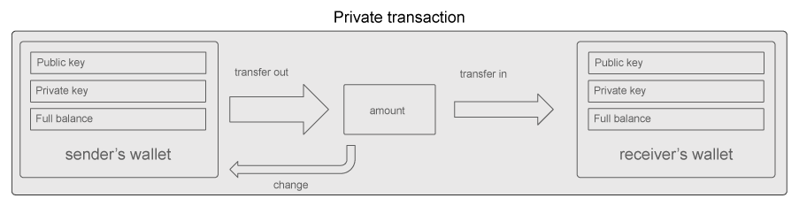
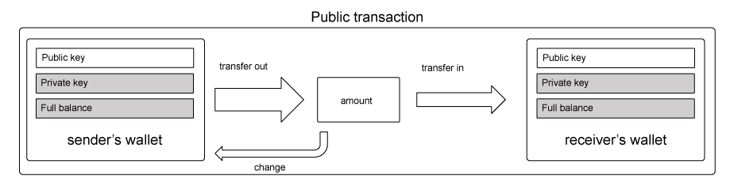

# Yellowpaper : Hybrid Transactions

## Abstract

_This yellow paper details the technical concepts and implementation of hybrid transactions \(also known as FlexPrivacy ©\), a feature enabling public and private transactions on the X-Cash public blockchain._ 

_In the first part, the paper aims at detailing how the hybrid transactions operate from a user’s perspective with some real-world use cases. A parallel is made between the digital money system and the economic behaviors associated with the current FIAT system. Secondly, a deeper understanding of the technology is given, explaining the implication on a blockchain perspective, as well as the edge cases and their approaches. Lastly, the last part consists in an in-depth approach of the mathematical concepts and technical implementation of the hybrid transaction in the X-Cash blockchain._

## Summary of the public transaction feature

The hybrid transaction feature allows users to send and receive public or private transactions on the X-Network Blockchain X-Cash, which is based on the CryptoNote protocol. This feature is implemented on a per transaction basis where users can directly switch the privacy type by choosing the setting before attempting to send a transaction.

 In a public transaction, the following additional information is made public: 

- Sender’s address   
- Receiver’s address  
- Amount sent   
- Change amount sent back to the sender’s address

 However, the public transaction does not compromise the sender’s or receiver’s wallet full balances nor the real mixin \(number of signatures in the ring signature that authorizes the transaction\) that provided the X-Cash balance. For privacy reasons, it is essential to keep these two details unknown in every transaction. 

The previous default transaction type of full privacy in CryptoNight coin \(through stealth addresses and RingCT\) remains available and unchanged in the new hybrid setup. This system is a very close approach to the current fiat system from a daily usage perspective, where the option is given to make a transaction leaving a trail \(similar to using check, credit card. . . etc.\) versus paying in cash which grants a potentially high level of anonymity. Either way, similarly to the fiat system, there is no need to have multiple accounts to pay with cash, or check and the account balance, as well as the receiverś account balance, is never made public. 

Public transactions have been made available on X-Cash since the 1.4.0 release on November 6 th, 2018 with backward compatibility.

## Introduction: A true digital money system

As of 2019, cryptocurrencies can be split between non-privacy coins \(Bitcoin, Ethereum\) and full privacy coins \(Monero, Grin... etc.\). While those technologies usually exist separately, some protocols offer an hybrid solution, notably Zcash, that requires multiple addresses, one for privacy features and one for transparent transactions.

X-Network team’s objective when creating the hybrid public/private transactions within the X-Cash system is to make both transaction types available to the user, from the same address, on a per transaction basis. The aim is to enable the user to have the same “privacy options” as in the traditional FIAT system. In the current FIAT system, the average distribution of money for an individual consists in having a portion of cash and most of their funds in a bank account. For most of the transactions, such as buying food or goods in a store, a person has two main options: pay using a credit card, check. . . etc. that will leave a transaction trail, or pay using cash which would assimilate it to an anonymous transaction.

This privacy duality found in the traditional payment system can be assimilated with the ability to choose between a public or private transaction on a decentralized payment system. Making that option accessible on the same blockchain and from the same wallet would make it more practical.

## Hybrid transaction on the X-Cash blockchain

The hybrid transactions feature on the X-Cash blockchain enables the choice on a per transaction basis to display the identifying details of a transaction to make it either public, or private. On a public transaction, the following information are publicly displayed:

• Sender’s address 

• Receiver’s address 

• Amount sent 

• Change amount sent back to the sender’s address

In X-Cash, private transactions have existed from the inception of the project; they are the default CryptoNight based payments that use stealth address and RingCT to keep the sender, receiver, inputs and amount private. This, in turn, keep the sender’s and receiver’s balance hidden. In a private transaction on the X-Cash blockchain, details about the transfer is made private to everyone except the sender and receiver.

A public transaction on the X-Cash blockchain will display additional information that needs to be recorded on the blockchain to make the transaction fully public. While the sender’s and receiver’s address are made public, neither balances are exposed. Additionally, the amounts and the change from the unspent part of the inputs going back to the sender are shown. 

While the transaction details are made public, there is a significant difference with regards to traceability as the balance of the wallet remains hidden. Exposing a wallet’s balance through a blockchain transaction is one of the primary concerns of public blockchains with public transactions.

In these blockchains, another anonymity threat is the disclosure of a wallet balance to anyone knowing the wallet address. In X-Cash, it has been chosen not to replicate these two features which make the blockchain transaction system closer to the fiduciary system where balances remain anonymous from a person to another.

Since X-CASH is based on CryptoNight \(CN\) technology and is a privacy coin at the core, it was also chosen to keep RingCT for both public and private transactions. This allows one to send a public transaction and still keep the core features of RingCT, which is the “mixin” of the Inputs, without compromising the privacy of a private transaction.

In practice, the implementation of public transactions on the X-Cash blockchain allowed viewing public transactions on a blockchain explorer, contrary to other CN coins. Any transaction sent publicly and linked to a public key can be viewed in the explorer when providing said user public address.

## Edge cases and solutions

### Public transactions in the ringCT

The first potential issue that arose was the inclusion of public transactions in the ring signatures, with the potential to hinder one’s privacy. 

When the ring size of a transaction is 2, there is a chance that one of the stealth address is a public X-Cash address. In that particular case, the mixin is completely known and privacy of the non public transaction is not attained.

This situation could arise because the ring size can be chosen on a transaction basis in classic cryptonote coins \(such as Monero\). To mitigate the potential impacts on privacy reduction, the transaction ring sized is increased and fixed to 21.

In that case, when assuming 50% public transactions on the network, it would mean that 10-11 out of 21 of the mixin would be known, leaving a 10% chance to find the real mixin of the transaction and consequently mitigate the privacy of the transaction. 

### Privacy in the inputs

When making a public transaction, the input associated to this transaction is made public. A case could arise where someone would want to have all of their inputs made private, and avoid having their transactions linked to an incoming public transaction.

The user would have to use a technique used in CryptoNight coins called a “churn”. In practice, this can be done by privately sending the full balance of one wallet back to itself, creating a new set of private inputs, breaking the links from any transaction the wallet has ever received.

This is materialized in CryptoNight by the sweep\_all  function. In the X-CASH blockchain, the function is still available as a command line and has been implemented in the GUI using the anonymize wallet feature.

## A technical explanation of public transactions

### A brief understanding of cryptonote transactions

The objective of this section is to dive deeper into the technical and mathematical workings of public transactions. The explanations are limited to the cryptographic components.

A brief overview of standard private transactions in cryptonote protocols is needed to better understand the underlyings of public transactions. When an X-Cash wallet is created, three main pieces of information are given \[1\]: 

•public key 

• view key 

• private key

The public key is the public address of the private key. One can think of this relationship as an asymmetrical encryption, where the public key is mathematically linked to the private key. The view key allows for anyone that knows the view key of a public key to see incoming funds into the wallet. The spend key allows one to create signatures in a transaction and in turn spend X-Cash. In this example, the three pieces of information for the demonstration of the X-Cash wallet are: 

public key: 

XCA1h3QnoPnNU32DrqE6mcDmtZzHx6ms6fopqnaJpG16TgAFzJA2RA4NJbHTVCDeXAGd5aNmibsQd8c7 DAmSLtpX6cv7ZPi8Kr 

view key: 

69dc4db4542ed49e42a7c001b367ce359f5176966fb619616e0f610247e13e0e

private key: 

1ff599322f839324b278319b44d87dc6c7d726c63a710b426aedd60afdad6108

When one wants to make a transaction, the private key is used to sign it. The details are hidden due to RingCT. Itself based upon ring signatures, which are a group of signatures where only one of the members is signing anonymously the message/transaction. In X-Cash, this leads to three points:

• A transaction is combined with 20 others to create this ring signature group \(21 transactions per RingCT\); 

• The amounts are hidden due to stealth addresses \(one-time-use keys that hold X-CASH\). This is how balances can be hidden, because they are stored away from the actual address and into many stealth addresses instead.

• Since any of the addresses in the ring signature could be the sender, an additional public key is generated for the transaction called a key image. The key images’ purpose is to link multiple signatures from the same private key, so the system can be sure a double spending has not occurred.

Inside the structure of each transaction, there are two main fields \[2\]:

• prefix 

• signatures

While the signatures have been briefly discussed, they remain outside of the scope of this paper, so the focus will be made on prefix. 

The prefix field contains several sub-fields:

• version 

• unlock\_time 

• input\_num 

• inputs 

• output\_num

 • outputs

 • extra\_size 

• extra

To understand public transactions, the below fields need to be detailed.

 input\_num, output\_num Numbers of inputs and outputs in a transaction.

Inputs are basically the key images that contain the real data of the transaction, and a list of each stealth address from the ring members group to hide who actually created the transaction. 

Outputs 

These are the stealth addresses. Each output contains: 

The amount \(hidden by ringCT in a private transaction\) 

The target \(the stealth address\)

The target is composed of a one-time generated public and private key pair to which the transaction is sent to on the blockchain. This is how funds can not be linked to any given public address on the blockchain: the actual amount does not go directly to the public address. Instead, it is stored in a one-time key, which is able to be unlocked using a few pieces of data that only the recipient would know, thus allowing them to spend the funds. 

Extra size The size of the extra field stored in varint encoding \[3\] 

Extra 

This is the part that makes public transactions possible. The extra field has 4 sub-fields \[4\]:

•Extra field size

 • Tx public key 

• Extra nonce 

• Tx size padding

The extra nonce is the field of subject for public transactions. This field usually will store the payment ID of a transaction if applicable; however, this field allows any arbitrary amount of bytes to be stored, and there are no protocol rules or verification of what can be stored in this field \[4\]. The way each piece of data is separated from each other is by prefixing the data with a particular tag. In public transactions, we prefix all of the data we need to store using the 0x02 tag, which is the extra nonce tag. This tag is structured as follows 

0x02 \| size of data \(in varint encoding\) \| data

### Creation of a public address

Together, the public view key and public spend key are used as a public key. Said key constitute the public key to another key pair, the private view key and private spend key. Public view and spend keys can be derived from the public address. A public address in X-CASH is 98 bytes long and is a base 58 representation of data. The initial data to create a public address is:

the network byte\(s\) \(in X-CASH it is 0x5c134\)\| public spend key \(32 bytes\) \| public view key \(32 bytes

This data is then run through the keccak\_256 hashing algorithm, bytes from the output are appended to the initial data, and then the initial data is converted to base 58 in 8-byte blocks... 

While the goal is not to fully detail the process, one can see that the initial data includes the public view key and public spend key of the public address. This means that we have to reverse the steps above on any address to get their public view key and public spend key.

### How stealth addresses/outputs are decoded

One can decode their corresponding outputs in a given transaction by either using their view key, or the transaction private key. The transaction private key is not the addresses private key; it is a private key that is generated when a transaction is sent. This is why all transactions also have a transaction public key as well. The transaction private key is mainly used to prove that funds were sent to a particular address. \[4\] When a transaction is created, before it is relayed to the network, the transaction private key is calculated using:

$$
R = r*G
$$

G = the Ed25519 base point 

r = a random scalar

$$
P = H(r*A || n)*G + B
$$

H = a hashing function \(keccak\_256 in this case\)

 r = the random scalar from above 

A = the receivers public view key n = the index of the output 

G = the Ed25519 base point

B = the receiverś public spend key

Once all the data is generated, the stealth address can be generated from the formula. This is how the sender will be able to receive X-Cash from that stealth address since it was created using their public view and public spend key pairs.

Another stealth address is also created for the spent outputs remaining in the unspent balance so it gets sent back to the sender and is calculated using their public view and spend keys.

To decode these stealth addresses one needs to calculate:

$$
P= H(a*R ´ || n)*G + B
$$

if P= P then this stealth address is decoded \(the amount is shown and it is mathematically ´ provable that the data given \(view key, private transaction key etc\) is the holder of that amount in that stealth address\).

If any reader has noticed, the private transaction key is used in the formula to create both the senders and receivers stealth address. This is important to keep note of since this is the underlining of how it will be possible to send a public transaction. 

This is the basics of how a private transaction works in the cryptonote algorithm.

### How public transactions are created

The last section highlighted that a stealth address could be decoded using any of those private key pairs in that formula. The private key of the receiver can be used to decode and spend one of the outputs, but it is important to note that the view key of each person would decode each stealth address. There is one common public / private key pair that is used in the formula above, and it is used in both stealth addresses \(the sender and the receiver\). This is known as the transaction private and transaction public key pair. 

To decode a stealth address, these three given options are only known to each party. This is how the information is kept private, because only the owners of each wallet know their private view key and private spend key. 

This implied that if the private transaction key was given to a third party, they could decode the transaction for both stealth addresses in that transaction \(the receivers amount as well as the sender’s change\).

So adding the tx private key in the tx extra makes the tx public. 

From there, several checks need to be done. A public transaction can hold 2 addresses to ensure data integrity: the receivers and the senders. Both stealth addresses in every public transaction have to be decipherable with the provided transaction private key; otherwise, the transaction will be considered an invalid public transaction \(but still a valid private transaction as it is accepted on the blockchain\). It is also necessary to verify that the sender is the address that actually sent that public transaction to ensure data integrity.

The first one is a limitation as of now and is why one can not have multiple receiving addresses in one public transaction. The second one is a step in the process. The third one is calculated by performing an additional step before the transaction gets relayed. 

To verify after the public transaction is relayed to the network that one XCA address is the sender, and thus the other one has to be the receiver, it is needed to link the private transaction key \(since the sender can only know this\) and the senderś public address. This is accomplished by using the private key of the sender, to sign a message that contains the transaction private key. This makes it possible to verify that the public address, which actually sent the transaction, is the correct sender once the transaction has been relayed in the network. 

To summarize, the following data needs to be added in the tx extra field: 

• The transaction private key.

 • The signature from the signed message of the transaction private key from the sender private key. 

• Public address 1. 

• Public address 2.

 To verify the public transaction after the transaction has been sent, the following process needs to be executed:

• Verify that there are only 2 output addresses. 

• Check the validity of the tx extra’s data structure 

• Check that the transaction private key can decode both outputs in the transaction.

Check to see which address is the sender by verifying the message against the two addresses in the transaction_._

This concludes how public addresses are created, and shows that they do not interfere in any way with X-Cash’s privacy. Public transactions also still give the sender the same level of privacy since his private signature is still mixed with 20 other members’ in the ring signature, thus giving his inputs the same level of privacy as for a private transaction.

## Conclusion

The major comparative advantage of hybrid transactions relies on their ability to be performed on the same wallet and using the same public address which simplifies their use and integration_._

From a user perspective, hybrid transactions are easy to use and have been implemented in the various tools of the X-Cash products: GUI CLI wallets, mining pool, explorer. . . etc_._

Public transactions are an essential component of the X-Network ecosystem and allow users to choose and adjust their level of anonymity when performing X-Cash transactions. Coupled with the sidechain solution, hybrid transactions will fulfill their potential and enable unique use cases.

## Bibliography

\[1\] M. J. T. N. N. A. M. J. Seigen. CRYPTONOTE STANDARD 007 : CryptoNote Keys and Addresses. [https://cryptonote.org/cns/cns007.txt](https://cryptonote.org/cns/cns007.txt) 

\[2\] M. J. T. N. N. A. M. J. Seigen. CRYPTONOTE STANDARD 004 : CryptoNote Transactions. [https://cryptonote.org/cns/cns004.txt](https://cryptonote.org/cns/cns004.txt) 

\[3\] M. J. T. N. N. A. M. J. Seigen. CRYPTONOTE STANDARD 003 : CryptoNote Blockchain. [https://cryptonote.org/cns/cns003.txt](https://cryptonote.org/cns/cns003.txt) 

\[4\] M. J. T. N. N. A. M. J. Seigen. CRYPTONOTE STANDARD 005 : CryptoNote Transaction Extra Field. [https://cryptonote.org/cns/cns005.txt](https://cryptonote.org/cns/cns005.txt)

